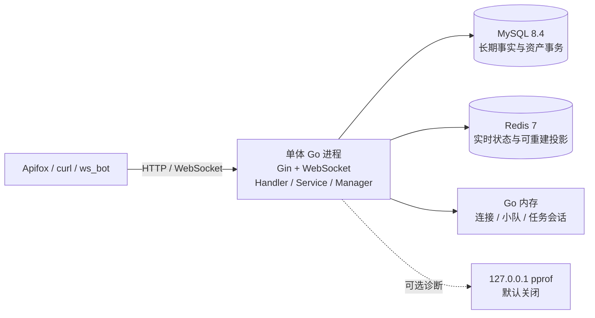

# Go 游戏业务后台与 GM 实时服务基础

> 文档角色：项目公开入口与快速启动
> 权威级别：L1（导航与当前能力摘要）
> 状态：二期本机验收完成；M7 发布状态见版本基线，跨机器延期
> 适用范围：本地学习、接口验证与求职展示
> 事实来源：当前 Go 代码、路由、SQL、Compose、M7 与历次验收证据
> 最后更新：2026-10-10

这是一个模块化单体 Go 学习项目，围绕玩家账号、GM 管理、WebSocket 小队、任务会话、Redis 匹配、幂等结算、资产流水、排行榜和实时观察建立完整业务闭环。

项目如实定位为“游戏业务后台与实时服务基础”，不是商业战斗服、微服务集群或云原生生产系统。

## V2 合作 PVE 入口

新增 `backend/internal/pve` 领域链路，覆盖好友/私聊/邀请/招募、好友房间与本局小队分离、整组票据与逐人确认、共同目标和可选个人任务、可信测试事件、有限增援、自动结算、持久化 Worker 与 Redis 重建。默认 `GAMEPLAY_MODE=v2`；旧一期回归必须显式设置 `GAMEPLAY_MODE=legacy`，不会把一期历史数据迁成 Run。

运行与验证步骤见 [V2 发布和运行指南](docs/pve-release-guide.md)。新库先执行 `v2_migrate -stage r4`，完整迁移 day37—40。React GM 已用真实 V2 服务完成浏览器验收；Unity Windows Player 已完成四人普通/混合来源闭环、重连和逐人结算。仍不代表真实战斗模拟、跨机器网络或商业容量。

[M7 综合验收](docs/testing/m7-acceptance.md)、[后续复核](docs/testing/post-m7-audit-20261010.md) 与 [持续运行基线](docs/performance/m7-local-soak.md) 记录二期本机证据；精确提交、PR 与 CI 见 [M7 发布基线](docs/testing/m7-release-acceptance.md)，交付边界见 [二期总结](docs/phase2-summary.md)。维护和回退见 [R4 实施](docs/design/v2-r4-implementation.md) 及 [回滚约束](docs/design/v2-r4-retirement-and-rollback-plan.md)。

## 当前快照

R5/M6 已新增 [独立 RPC/MQ 实验](experiments/r5-m6/README.md)：只读 gRPC 排行/Run 结果、恢复副本 outbox 桥接、RabbitMQ 可靠投递和幂等报表。它不进入主请求/资产链路；本机真实存储、崩溃恢复与故障隔离证据见 [R5 验收](docs/testing/r5-m6-acceptance.md)。

R5与全面复核修复已通过PR #3发布到main，合并后主项目/R5两套Actions全部成功；当前源码/提交/CI及回滚基线见 [R5公开发布](docs/testing/r5-release-acceptance.md)。源工作区的未提交内容与远程发布分别保留。

- 单个 Go 进程提供 Gin HTTP API 和 Gorilla WebSocket。
- MySQL 8.4 保存账号、审计、结算、奖励、余额与资产流水。
- Redis 7 保存在线 TTL、匹配队列和排行榜等可重建投影。
- legacy 仍有进程内连接/小队/任务状态；V2 的 Party、票据、Run、任务和结算事实以 MySQL 为准，WebSocket 连接只保存在进程内。
- Day27-Day35 一期范围已完成并收口。
- React GM 观察页面与 Unity 控制面已加入；Unity Editor 场景联调和跨机器验收仍延期。
- 当前没有微服务、Zinx、Kubernetes、生产部署或云端服务；仓库包含后端 Dockerfile 和 GitHub Actions 验证流程。

## 已实现能力

### 玩家与 GM

- 玩家注册、登录、资料查询、昵称修改、列表与详情。
- 玩家 JWT 与管理员 JWT subject 隔离。
- Redis 在线心跳与在线状态查询。
- 管理员登录、Dashboard、玩家查询、封禁与解封。
- GM 操作日志分页、筛选、详情与危险操作事务审计。

### 实时业务

- WebSocket 鉴权、连接替换、ping/pong、读写超时、单连接写锁和 4096 字节消息限制。
- 小队创建、加入、离开、ready、断线状态、重连和队长转移。
- 任务会话 `waiting -> ready -> running -> finished` 与 `waiting -> canceled`。
- Redis 匹配 ticket `queued -> canceled/timeout`、队列位置和后台超时清理。
- 统一 JSON 请求/响应、`request_id` 和服务端主动广播。

### 结算与观察

- 服务端计算耗时、分数和固定奖励，不信任客户端分数与奖励。
- `mission_instance_id`、`idempotency_key`、玩家 nonce 三层幂等/防重放约束。
- 任务记录、多人奖励、余额和 append-only 资产流水在同一 MySQL 事务提交。
- `SELECT ... FOR UPDATE` 和固定玩家 ID 顺序保护资产更新。
- MySQL 成功后 best-effort 同步 Redis 最佳分排行榜；同分先达到者优先。
- 玩家 Top N、个人排名、历史战绩，以及 GM 实时摘要、玩家观察和结算查询。

## 当前架构



详细边界见 [当前系统架构](docs/architecture.md) 和 [系统详细设计](docs/system-design.md)。

## 技术栈

- Go 1.25、Gin、Gorilla WebSocket
- `database/sql`、`go-sql-driver/mysql`
- MySQL 8.4.11 LTS、Redis 7
- JWT、bcrypt、go-redis
- Docker Compose
- Go test、vet、race、pprof、`ws_bot`

## 快速启动

### 1. 启动依赖

```powershell
cd .\deploy
docker compose up -d
docker compose ps
```

应看到 `game_realtime_mysql` 和 `game_realtime_redis` 运行。MySQL 使用 `3306`，Redis 使用 `6379`；本机同类服务不能占用相同端口。

### 2. 初始化 schema 和本地 seed

在仓库根目录执行：

```powershell
Get-Content .\backend\internal\database\schema.sql -Raw |
  docker exec -i game_realtime_mysql sh -lc 'mysql -u"$MYSQL_USER" -p"$MYSQL_PASSWORD" "$MYSQL_DATABASE"'

Get-Content .\backend\internal\database\seed.sql -Raw |
  docker exec -i game_realtime_mysql sh -lc 'mysql -u"$MYSQL_USER" -p"$MYSQL_PASSWORD" "$MYSQL_DATABASE"'
```

Compose 和 seed 中的账号只供本地学习；任何共享或公网环境都必须覆盖数据库密码、管理员密码和 JWT Secret。

### 3. 启动 Go 服务

```powershell
cd .\backend
$env:V2_MIGRATION_CONFIRM = "I_UNDERSTAND_V2_MIGRATION"
go run .\cmd\tools\v2_migrate -stage r4
go run .\cmd\server
```

默认地址为 `http://localhost:8080`。新库首次启动前必须先完成 day37—day40 迁移；旧一期学习回归可在同一明确停写边界下设置 `GAMEPLAY_MODE=legacy`。健康检查：

```powershell
Invoke-RestMethod http://localhost:8080/health
```

### 4. 常用环境变量

| 变量 | 用途 |
| --- | --- |
| `APP_PORT` | HTTP/WebSocket 监听端口 |
| `APP_HOST` | 主监听地址；留空沿用所有网卡，本机验收设为 `127.0.0.1` |
| `DB_MAX_OPEN_CONNS/DB_MAX_IDLE_CONNS` | MySQL连接预算，默认 `20/10` |
| `REDIS_POOL_SIZE/REDIS_MAX_ACTIVE_CONNS/REDIS_POOL_TIMEOUT_MS` | Redis默认base池10、硬上限20、等待1000毫秒 |
| `DB_HOST`、`DB_PORT`、`DB_USER`、`DB_PASSWORD`、`DB_NAME` | MySQL 连接 |
| `REDIS_ADDR`、`REDIS_PASSWORD`、`REDIS_DB` | Redis 连接 |
| `JWT_SECRET` | 玩家/管理员 JWT 签名密钥 |
| `PPROF_ENABLED`、`PPROF_ADDR` | 本机 pprof 开关与地址 |

完整环境和排障步骤见 [部署、运维与排障](docs/deployment-runbook.md)。

## 验证

```powershell
cd .\backend
$goFiles = Get-ChildItem .\cmd,.\internal -Recurse -Filter *.go | Select-Object -ExpandProperty FullName
gofmt -d $goFiles
go test ./...
go vet ./...
```

Day34 已在官方 Linux Go 镜像内执行 `go test -race ./...` 并通过；该结果只覆盖测试实际执行到的路径。`ws_bot` 的本机短时基线也不代表生产容量。

## 文档入口

- [公开文档索引](docs/public-index.md)
- [需求规格](docs/requirements-spec.md)
- [技术可行性](docs/technical-feasibility.md)
- [OpenAPI 3.1 HTTP 契约](docs/openapi.yaml)
- [HTTP API 使用指南](docs/api-overview.md)
- [WebSocket 协议](docs/ws-protocol.md)
- [数据库设计](docs/database-design.md)
- [安全设计](docs/security-design.md)
- [测试计划](docs/test-plan.md)
- [一期成果与证据](docs/phase1-summary.md)

## 能力边界

`mission_instance` 是任务会话与结算生命周期元数据，不是战斗服进程。当前 Go 服务不执行固定 Tick、物理、技能判定、怪物 AI、客户端预测、延迟补偿或商业级状态同步；也不应把本地测试、race 或性能基线描述成生产经验。
