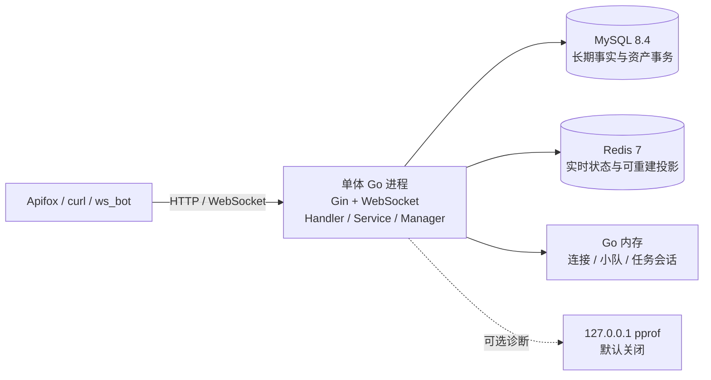

# Go 游戏业务后台与 GM 实时服务基础

> 文档角色：项目公开入口与快速启动
> 权威级别：L1（导航与当前能力摘要）
> 状态：一期与V2 R3本机/集成CI已验证；正式切换与跨机器延期
> 适用范围：本地学习、接口验证与求职展示
> 事实来源：当前 Go 代码、路由、SQL、Docker Compose 与 Day27-Day35 验收证据
> 最后更新：2026-10-07

这是一个模块化单体 Go 学习项目，围绕玩家账号、GM 管理、WebSocket 小队、任务会话、Redis 匹配、幂等结算、资产流水、排行榜和实时观察建立完整业务闭环。

项目如实定位为“游戏业务后台与实时服务基础”，不是商业战斗服、微服务集群或云原生生产系统。

## V2 合作PVE与R3

新增好友房间、整组票据、逐人候选确认、共同目标/可选个人任务、受信事件、有限增援、独立结算和可靠Worker。好友房间与本局小队分开；默认仍 `GAMEPLAY_MODE=legacy`，V2需要显式设置 `v2` 并执行编号迁移，不双写旧玩法资产，不把一期历史迁成Run。

- [V2发布和运行指南](docs/pve-release-guide.md)
- [R3发布验收](docs/testing/r3-release-acceptance.md)
- [R4退役与回滚计划](docs/design/v2-r4-retirement-and-rollback-plan.md)
- [Unity控制面](client/unity-demo/README.md)

## 当前快照

- 单个 Go 进程提供 Gin HTTP API 和 Gorilla WebSocket。
- MySQL 8.4 保存账号、审计、结算、奖励、余额与资产流水。
- Redis 7 保存在线 TTL、匹配 ticket/队列/超时索引和排行榜投影。
- Go 内存保存 WebSocket 连接、小队和任务会话状态。
- Day27-Day35 一期范围已完成并收口。
- React GM/PVE页面、Unity控制面和Dockerfile已提供；GitHub Actions已验证Go/集成race/前端构建。
- 当前没有真实战斗服、微服务、Zinx、Kubernetes或云端部署；CI不等于自动上线。

## 已实现能力

### 玩家与 GM

- 玩家注册、登录、资料查询、昵称修改、列表与详情。
- 玩家 JWT 与管理员 JWT subject 隔离。
- Redis 在线心跳与在线状态查询。
- 管理员登录、Dashboard、玩家查询、封禁与解封。
- GM 操作日志分页、筛选、详情与危险操作事务审计。

### 实时业务

- WebSocket 鉴权、连接替换、ping/pong、读写超时、单连接写锁和 4096 字节消息限制。
- 小队创建、加入、离开、ready、断线状态、重连和队长转移。
- 任务会话 `waiting -> ready -> running -> finished` 与 `waiting -> canceled`。
- Redis 匹配 ticket `queued -> canceled/timeout`、队列位置和后台超时清理。
- 统一 JSON 请求/响应、`request_id` 和服务端主动广播。

### 结算与观察

- 服务端计算耗时、分数和固定奖励，不信任客户端分数与奖励。
- `mission_instance_id`、`idempotency_key`、玩家 nonce 三层幂等/防重放约束。
- 任务记录、多人奖励、余额和 append-only 资产流水在同一 MySQL 事务提交。
- `SELECT ... FOR UPDATE` 和固定玩家 ID 顺序保护资产更新。
- MySQL 成功后 best-effort 同步 Redis 最佳分排行榜；同分先达到者优先。
- 玩家 Top N、个人排名、历史战绩，以及 GM 实时摘要、玩家观察和结算查询。

## 当前架构



详细边界见 [当前系统架构](docs/architecture.md) 和 [系统详细设计](docs/system-design.md)。

## 技术栈

- Go 1.25、Gin、Gorilla WebSocket
- `database/sql`、`go-sql-driver/mysql`
- MySQL 8.4.11 LTS、Redis 7
- JWT、bcrypt、go-redis
- Docker Compose
- Go test、vet、race、pprof、`ws_bot`

## 快速启动

### 1. 启动依赖

```powershell
cd .\deploy
docker compose up -d
docker compose ps
```

应看到 `game_realtime_mysql` 和 `game_realtime_redis` 运行。MySQL 使用 `3306`，Redis 使用 `6379`；本机同类服务不能占用相同端口。

### 2. 初始化 schema 和本地 seed

在仓库根目录执行：

```powershell
Get-Content .\backend\internal\database\schema.sql -Raw |
  docker exec -i game_realtime_mysql sh -lc 'mysql -u"$MYSQL_USER" -p"$MYSQL_PASSWORD" "$MYSQL_DATABASE"'

Get-Content .\backend\internal\database\seed.sql -Raw |
  docker exec -i game_realtime_mysql sh -lc 'mysql -u"$MYSQL_USER" -p"$MYSQL_PASSWORD" "$MYSQL_DATABASE"'
```

Compose 和 seed 中的账号只供本地学习；任何共享或公网环境都必须覆盖数据库密码、管理员密码和 JWT Secret。

### 3. 启动 Go 服务

```powershell
cd .\backend
go run .\cmd\server
```

默认地址为 `http://localhost:8080`，健康检查：

```powershell
Invoke-RestMethod http://localhost:8080/health
```

### 4. 常用环境变量

| 变量 | 用途 |
| --- | --- |
| `APP_PORT` | HTTP/WebSocket 监听端口 |
| `DB_HOST`、`DB_PORT`、`DB_USER`、`DB_PASSWORD`、`DB_NAME` | MySQL 连接 |
| `REDIS_ADDR`、`REDIS_PASSWORD`、`REDIS_DB` | Redis 连接 |
| `JWT_SECRET` | 玩家/管理员 JWT 签名密钥 |
| `PPROF_ENABLED`、`PPROF_ADDR` | 本机 pprof 开关与地址 |

完整环境和排障步骤见 [部署、运维与排障](docs/deployment-runbook.md)。

## 验证

```powershell
cd .\backend
$goFiles = Get-ChildItem .\cmd,.\internal -Recurse -Filter *.go | Select-Object -ExpandProperty FullName
gofmt -d $goFiles
go test ./...
go vet ./...
```

Day34 已在官方 Linux Go 镜像内执行 `go test -race ./...` 并通过；该结果只覆盖测试实际执行到的路径。`ws_bot` 的本机短时基线也不代表生产容量。

## 文档入口

- [公开文档索引](docs/public-index.md)
- [需求规格](docs/requirements-spec.md)
- [技术可行性](docs/technical-feasibility.md)
- [OpenAPI 3.1 HTTP 契约](docs/openapi.yaml)
- [HTTP API 使用指南](docs/api-overview.md)
- [WebSocket 协议](docs/ws-protocol.md)
- [数据库设计](docs/database-design.md)
- [安全设计](docs/security-design.md)
- [测试计划](docs/test-plan.md)
- [一期成果与证据](docs/phase1-summary.md)

## 能力边界

`mission_instance` 是任务会话与结算生命周期元数据，不是战斗服进程。当前 Go 服务不执行固定 Tick、物理、技能判定、怪物 AI、客户端预测、延迟补偿或商业级状态同步；也不应把本地测试、race 或性能基线描述成生产经验。
