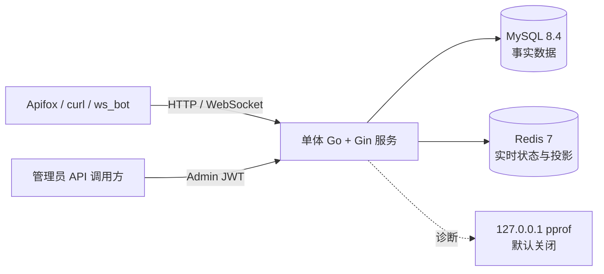

# Go 游戏后台与 GM 运营服务

一个基于 Go、Gin、MySQL、Redis 和 WebSocket 的单体游戏业务后端，覆盖玩家服务、GM 运营、小队与任务会话、匹配 ticket、幂等结算、资产流水、排行榜和实时观察。

当前一期已完成。项目定位是可运行、可测试、可解释的游戏后台工程实践，不是完整商业战斗服。

## 已实现能力

### 玩家与权限

- 玩家注册、登录和 JWT。
- 玩家资料、昵称、列表和详情。
- 管理员登录与独立 JWT subject type。
- 玩家 token、管理员 token 和 WebSocket 玩家身份隔离。
- 被封禁玩家禁止登录。
- 密码使用 bcrypt hash，不返回 `password_hash`。

### GM 运营

- 玩家列表、详情、封禁和解封。
- 危险操作写入 `admin_operation_logs`。
- 操作日志分页、筛选、动作列表和详情。
- Dashboard 玩家与操作统计。
- 当前连接、小队、匹配、任务和结算摘要。
- 玩家在线、小队、任务、ticket、余额和最近结算聚合观察。
- 管理员结算筛选与排行榜查询。

### 实时连接与小队

- WebSocket 玩家 token 鉴权。
- 同一玩家新连接替换旧连接。
- `connection_id` 条件注销，避免旧连接影响新连接。
- ping/pong、读写 deadline 和单连接写锁。
- Redis 在线 TTL 自动续期。
- 小队 create、join、leave、ready 和 me。
- 小队状态主动广播。
- 断线成员 `online=false`、`ready=false`。
- 队长断线或离队后转移给最早加入的在线成员。
- 最后一名成员离开时解散小队。

### PVE 业务生命周期

- 任务会话 create、ready、start、finish、cancel 和 me。
- `waiting -> ready -> running -> finished` 与 `waiting -> canceled` 状态机。
- Redis matchmaking ticket、任务队列、玩家索引和超时索引。
- queued、canceled 和 timeout。
- 服务端计算结算耗时、分数和固定奖励。
- `mission_instance_id`、`idempotency_key`、玩家 nonce 三层幂等约束。
- `SELECT ... FOR UPDATE` 锁定资产行。
- 任务、reward、余额和 append-only ledger 同事务提交。
- Redis 个人最佳分排行榜和同分先达到者优先。
- Top N、我的排名和 MySQL settled 战绩分页。

### 工程质量

- 统一 Request ID。
- AccessLog 只记录 path，不记录 WebSocket query token。
- 默认关闭、仅本机启用的独立 pprof。
- `cmd/tools/ws_bot` 自动执行多玩家完整流程。
- Go 单元测试、`go vet` 和 Docker Linux `go test -race`。
- 可复现的 Day34 本机性能基线。

## 当前架构



详细内容见[当前系统架构](docs/architecture.md)和[关键业务数据流](docs/data-flow.md)。

## 数据职责

| 位置 | 当前数据 |
| --- | --- |
| MySQL | players、admins、GM 审计、mission/reward、player_assets、asset_ledger |
| Redis | online TTL、matchmaking ticket/queue/timeout、leaderboard 投影 |
| Go 内存 | WebSocket clients、小队、任务会话 |

MySQL 是结算和核心资产事实源。Redis 排行榜在 MySQL 提交后 best-effort 更新，可重建，不参与资产入账。

## 关键工程决策

- 一期保持单体，优先保证业务闭环、可测试和可解释。
- `mission_instance` 是任务会话元数据，不是战斗服进程。
- 核心资产使用 MySQL 强事务，不使用纯异步 Redis 写回。
- 幂等最终由数据库唯一约束保护，先查后写只优化正常重试。
- Dashboard 只读轮询不写高频危险操作审计。
- pprof 与业务 Router 隔离，默认关闭且不开放公网。

## 技术栈

- Go 1.25。
- Gin。
- MySQL 8.4.11 LTS。
- Redis 7。
- `database/sql` + `go-sql-driver/mysql`。
- Gorilla WebSocket。
- JWT + bcrypt。
- Docker Compose。

## 快速启动

### 1. 启动 MySQL 和 Redis

```powershell
cd .\deploy
docker compose up -d
docker compose ps
```

应看到：

```text
game_realtime_mysql
game_realtime_redis
```

### 2. 初始化数据库

回到项目根目录：

```powershell
cd ..

Get-Content .\backend\internal\database\schema.sql -Raw |
  docker exec -i game_realtime_mysql mysql -ugame -pgame123456 game_realtime

Get-Content .\backend\internal\database\seed.sql -Raw |
  docker exec -i game_realtime_mysql mysql -ugame -pgame123456 game_realtime
```

全新数据库只执行最新 `schema.sql` 和 `seed.sql`。不要再重复执行历史 migration。

本地开发管理员：

```text
username: admin
password: admin123456
```

这些凭据只用于本地学习环境。

### 3. 启动后端

```powershell
cd .\backend
go run .\cmd\server
```

健康检查：

```text
GET http://localhost:8080/health
```

## 环境变量

```text
APP_PORT=8080
PPROF_ENABLED=false
PPROF_ADDR=127.0.0.1:6060

DB_HOST=localhost
DB_PORT=3306
DB_USER=game
DB_PASSWORD=game123456
DB_NAME=game_realtime

REDIS_ADDR=localhost:6379
REDIS_PASSWORD=
REDIS_DB=0

JWT_SECRET=game-realtime-dev-secret
```

默认值只用于本地。公开部署必须使用独立强密码和随机 `JWT_SECRET`。

## 主要接口

```text
POST /api/register
POST /api/login
GET  /api/me
PATCH /api/me/nickname
GET  /api/leaderboards/:mission_id
GET  /api/leaderboards/:mission_id/me
GET  /api/me/mission-records

POST /api/admin/login
GET  /api/admin/dashboard/summary
GET  /api/admin/players
POST /api/admin/players/:id/ban
POST /api/admin/players/:id/unban
GET  /api/admin/operation-logs
GET  /api/admin/realtime/summary
GET  /api/admin/realtime/players/:id
GET  /api/admin/settlements
GET  /api/admin/leaderboards/:mission_id

GET  /ws
```

完整参数、响应和错误码见 `docs/api-overview.md`。

## WebSocket 消息

当前消息分组：

```text
server.welcome / server.error
debug.echo
squad.*
mission.*
matchmaking.*
settlement.*
```

请求和响应通过 `request_id` 关联。当前学习环境使用 query 参数传玩家 token，AccessLog 不记录 query。

## 验证

### 常规检查

```powershell
cd .\backend
gofmt -d .\cmd\server .\cmd\tools\ws_bot .\internal
go test ./...
go vet ./...

cd ..\deploy
docker compose config
```

### Race

Windows 本机没有 GCC。使用官方 Go Linux 镜像：

```powershell
cd .\backend
docker run --rm -v "${PWD}:/workspace" -w /workspace golang:1.25-bookworm go test -race ./...
```

Day34 验收中全部包通过。Race 只覆盖测试实际执行到的路径。

### 多玩家冒烟

先启动后端，再执行：

```powershell
go run .\cmd\tools\ws_bot `
  -http-url http://127.0.0.1:8080 `
  -ws-url ws://127.0.0.1:8080/ws `
  -clients 8 `
  -squad-size 4 `
  -echo-rounds 10 `
  -hold 10s
```

工具会创建或复用 `day34bot_*` 本地测试账号。运行结束后按 `docs/performance/day34-baseline.md` 的清理步骤删除测试数据。

## Day34 本机基线

环境：单机、单进程、回环网络。

```text
20 个 WebSocket 客户端
5 个四人小队
10000 次 debug.echo
所有 stage failure=0
echo Average=106us
echo P95=611us
echo Maximum=2.513ms
goroutine: hold 70 -> cleanup 8
```

这些数字只用于同环境复测，不代表生产容量。

## 目录结构

```text
backend/
  cmd/server/                 服务入口
  cmd/tools/ws_bot/           多玩家流程工具
  internal/auth/              JWT
  internal/cache/             Redis
  internal/config/            环境变量
  internal/database/          MySQL、schema、seed、migration
  internal/diagnostics/       pprof
  internal/handler/           HTTP / WebSocket handler
  internal/leaderboard/       排行榜与战绩
  internal/matchmaking/       ticket、队列与超时
  internal/middleware/        鉴权、Request ID、安全日志
  internal/mission/           任务会话状态机
  internal/observation/       GM 只读聚合
  internal/settlement/        幂等结算和资产事务
  internal/squad/             小队状态
  internal/ws/                连接管理与协议 DTO

deploy/                       MySQL / Redis Compose
docs/                         架构、数据流、API 和工程证据
```

## 文档导航

- [当前系统架构](docs/architecture.md)
- [关键业务数据流](docs/data-flow.md)
- [一期能力、证据和边界](docs/phase1-summary.md)
- [HTTP API 与 WebSocket](docs/api-overview.md)
- [本机负载、pprof 和 race](docs/performance/day34-baseline.md)
- [MySQL 数据库选型记录](docs/adr/0006-使用MySQL作为主数据库.md)
- [安全发布流程](docs/github-workflow.md)

## 当前边界

- 单体、单实例 Go 服务。
- 小队和任务会话在内存中，服务重启后清空。
- 匹配只实现 queued/canceled/timeout，没有 matched。
- 没有逐帧战斗模拟、物理、技能判定、怪物 AI、客户端预测或延迟补偿。
- 没有 React GM 页面或 Unity Demo。
- 没有公网部署、多实例、弱网或长期稳定性证据。
- 本机性能数据不是生产容量承诺。
