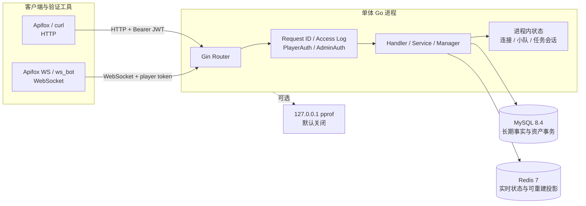

# 当前系统架构（HLD）

> 文档角色：当前高层架构、运行拓扑和系统边界
> 权威级别：L1（HLD 事实源）
> 状态：已实现
> 适用范围：legacy历史与V2/R4本机Go单体
> 事实来源：`cmd/server`、`internal/router`、Docker Compose、MySQL schema 与 Redis 实现
> 最后更新：2026-10-10

## 1. 架构范围

当前系统是单实例、单进程的模块化 Go 单体。它对外提供 HTTP API 和玩家 WebSocket，对内连接 MySQL、Redis，并可选择启动仅绑定本机的 pprof 服务。

本图描述legacy一期；V2/R4边界见发布指南。默认V2使用持久化准入与Worker，旧内存装配只在显式legacy模式启用。仍不包含真实Dedicated Server、微服务、Kubernetes或云资源。

V2使用 `internal/pve` 领域链路，MySQL保存Party、ticket、proposal、Run、事件、任务、奖励和pending事实，Redis仅保存可重建投影。Run裁决不接受房主finish；逐人结算可独立重试。R3提供归档、连接配额、loopback指标、GM修复和非root镜像。

## 2. 运行拓扑

## 3. 容器与进程

| 组件 | 当前运行方式 | 端口 | 持久性 |
| --- | --- | --- | --- |
| Go 服务 | 宿主机 `go run`/二进制 | `8080` 默认 | 进程状态不持久 |
| pprof | Go 内独立 HTTP server，默认关闭 | `127.0.0.1:6060` 默认 | 不保存 profile |
| MySQL | Docker Compose | `3306` | Docker volume |
| Redis | Docker Compose | `6379` | Docker volume，但业务只依赖其可重建/临时职责 |

当前有Go服务Dockerfile及GitHub Actions测试构建；没有反向代理、TLS终止、Ingress、负载均衡或自动部署。

## 4. 数据所有权

| 数据 | 所有者 | 原因与恢复边界 |
| --- | --- | --- |
| 玩家、管理员、GM 审计 | MySQL | 长期事实，需要查询、唯一约束和事务 |
| 任务结算、奖励、余额、资产流水 | MySQL | 资产事实源，必须强事务与幂等 |
| 在线状态 | Redis | TTL 型近实时状态，失效后可由客户端重建 |
| 匹配 ticket、队列、超时索引 | Redis | 高频、短期状态，当前不要求跨故障恢复承诺 |
| 排行榜 | Redis 投影，MySQL 为来源 | 查询优化，可从 settled 记录重建 |
| WebSocket 连接 | Go 内存 | 仅当前进程有效 |
| 小队与任务会话 | Go 内存 | 一期业务原型，服务重启后清空 |

## 5. 信任边界

- 公共网络输入进入 Gin/WebSocket Handler 前均视为不可信。
- 玩家与管理员通过不同 JWT subject 类型隔离。
- 客户端不能提交可信分数、奖励或最终资产余额。
- MySQL 提交后的结算是事实；Redis 排行同步失败不能回滚资产事务。
- GM 实时观察跨内存、Redis、MySQL 依次读取，不是原子快照。

详细风险与控制见 [安全设计](security-design.md)。

## 6. 可用性与扩展边界

当前只验证单实例本地运行：

- Go 进程故障会中断全部 HTTP/WebSocket，并丢失连接、小队和任务会话。
- 没有服务发现、健康探针编排、自动重启 Go 服务或多副本切换。
- 内存 Manager 使服务不能直接水平扩展。
- Redis 和 MySQL 都是单容器开发配置，没有高可用或自动故障转移。
- 没有生产 SLO、RPO/RTO 或容量承诺。

## 7. 当前非目标

- 完整战斗服、固定 Tick 或商业级网络同步。
- 微服务、Zinx、消息队列、Kubernetes、Agones 或服务网格。
- 完整商业游戏客户端、云端环境或生产监控平台；已有React/Unity控制面验证器。
- 将本机 Day34 数据外推为商业并发能力。

模块内部调用、锁、状态机、事务和失败处理见 [系统详细设计](system-design.md)。

## 8. R5/M6 独立实验边界

`experiments/r5-m6` 是独立 Go 模块和独立运行角色，不由 `backend` 导入。gRPC 仅查询恢复副本中的有限 settled 视图；只读 Bridge 扫描 `v2.run.result` outbox，将投递状态写独立报表数据库，再经 RabbitMQ 发布确认与提交后 ACK 形成幂等报表。原 Worker 的 pending/outbox 状态与资产事务不参与这条实验链。

真实本机验证包括主服务四人结算、合成备份恢复、数据库/MQ 最小权限、消费者提交后崩溃、broker/数据库/RPC 重启和实验停止后主服务继续结算。所有实验端口仅本机；没有引入主链路 RPC/MQ、服务发现、真实战斗服或多实例。契约、启停与图见 [实验入口](../experiments/r5-m6/README.md)，证据见 [R5 验收](testing/r5-m6-acceptance.md)。
