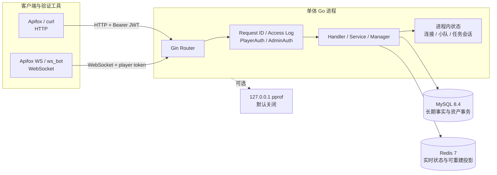

# 当前系统架构（HLD）

> 文档角色：当前高层架构、运行拓扑和系统边界
> 权威级别：L1（HLD 事实源）
> 状态：已实现
> 适用范围：legacy 一期与 V2 Go 单体服务
> 事实来源：`cmd/server`、`internal/router`、Docker Compose、MySQL schema 与 Redis 实现
> 最后更新：2026-10-10

## 1. 架构范围

第1—7节保留一期 legacy 拓扑与边界；V2 新增模块、可靠事实及客户端验证见第8节。

当前系统是单实例、单进程的模块化 Go 单体。它对外提供 HTTP API 和玩家 WebSocket，对内连接 MySQL、Redis，并可选择启动仅绑定本机的 pprof 服务。

本图聚焦 Go 后端与存储，不展开 React GM、Unity 控制面和未来 Dedicated Server；React/Unity 已存在并通过本机验证，Dedicated Server、微服务、Kubernetes 和云资源仍未实现。

## 2. 运行拓扑

## 3. 容器与进程

| 组件 | 当前运行方式 | 端口 | 持久性 |
| --- | --- | --- | --- |
| Go 服务 | 宿主机 `go run`/二进制 | `8080` 默认 | 进程状态不持久 |
| pprof | Go 内独立 HTTP server，默认关闭 | `127.0.0.1:6060` 默认 | 不保存 profile |
| MySQL | Docker Compose | `3306` | Docker volume |
| Redis | Docker Compose | `6379` | Docker volume，但业务只依赖其可重建/临时职责 |

仓库提供 Go 服务 Dockerfile、GitHub Actions 验证和本机监控 Compose；没有反向代理、TLS 终止、Ingress、负载均衡或自动部署。

## 4. 数据所有权

| 数据 | 所有者 | 原因与恢复边界 |
| --- | --- | --- |
| 玩家、管理员、GM 审计 | MySQL | 长期事实，需要查询、唯一约束和事务 |
| 任务结算、奖励、余额、资产流水 | MySQL | 资产事实源，必须强事务与幂等 |
| 在线状态 | Redis | TTL 型近实时状态，失效后可由客户端重建 |
| legacy 匹配 ticket、队列、超时索引 | Redis | 一期高频、短期状态 |
| V2 Party、票据、Proposal、Run、任务与结算事实 | MySQL | V2 可靠事实源；Redis只保存可重建队列/展示投影 |
| 排行榜 | Redis 投影，MySQL 为来源 | 查询优化，可从 settled 记录重建 |
| WebSocket 连接 | Go 内存 | 仅当前进程有效 |
| legacy 小队与任务会话 | Go 内存 | 一期业务原型，服务重启后清空 |

## 5. 信任边界

- 公共网络输入进入 Gin/WebSocket Handler 前均视为不可信。
- 玩家与管理员通过不同 JWT subject 类型隔离。
- 客户端不能提交可信分数、奖励或最终资产余额。
- MySQL 提交后的结算是事实；Redis 排行同步失败不能回滚资产事务。
- GM 实时观察跨内存、Redis、MySQL 依次读取，不是原子快照。

详细风险与控制见 [安全设计](security-design.md)。

## 6. 可用性与扩展边界

当前只验证单实例本地运行：

- Go 进程故障会中断全部 HTTP/WebSocket，并丢失连接、小队和任务会话。
- 没有服务发现、健康探针编排、自动重启 Go 服务或多副本切换。
- 内存 Manager 使服务不能直接水平扩展。
- Redis 和 MySQL 都是单容器开发配置，没有高可用或自动故障转移。
- 没有生产 SLO、RPO/RTO 或容量承诺。

## 7. 当前非目标

- 完整战斗服、固定 Tick 或商业级网络同步。
- 微服务、Zinx、消息队列、Kubernetes、Agones 或服务网格。
- 跨机器正式客户端联调、云端环境或生产监控平台。
- 将本机 Day34 数据外推为商业并发能力。

模块内部调用、锁、状态机、事务和失败处理见 [系统详细设计](system-design.md)。

## 8. V2 架构补充

`GAMEPLAY_MODE=v2` 使用 `internal/pve` 领域包和独立 V2 Handler，legacy 玩法入口与后台超时循环不运行。MySQL 保存 Party、完整票据、Proposal、Run 快照、事件与水位、任务、奖励、账本和 pending/outbox；Redis 只投影队列和奖励展示。Worker 在同一进程中处理维护、结算和提交后通知，不引入 MQ 或 RPC。

玩家通过 HTTP/WS 发送选择、准备和确认；受控 `pve_event_bot` 经独立默认关闭的本机 HTTP 端口提交局内事实。业务服务根据配置完成共同目标和逐人任务，自动结算。服务重启保留好友房间并清准备，取消未分配流程，中止演示 Run，并恢复待处理结算；不恢复真实战斗模拟。

React 观察窗已连接真实 V2 服务完成本机浏览器验证；Unity Windows Player 已完成四人普通/混合来源闭环、重连和逐人结算，Editor/场景/多 PC 联调未验证。当前仍没有商业 DS、多实例、高可用或容量承诺。

R1 将共同结果固定、逐人结算事务、全员关闭和受控故障重试分开；本人恢复查询使用一致MySQL读视图。迁移沿用编号SQL与checksum账本，工具和服务共享单库排他边界；Redis限流及业务投影不承担资产事实。本机开发库已获授权迁移并验证，R4 day40已应用，默认玩法为v2；正式ADR保持原验证门槛。

R2继续保持模块化单体：规则版本、预览、招募偏好、票据来源、续组提案和任务周期事实落MySQL；Redis仍只做投影/限流。网页控制面通过Vite本机代理HTTP/WS，不持有事件来源凭据；Unity仅调用控制面。R2的day38表和R4的day40表已在隔离库和本机开发库执行，默认v2与显式legacy回归分开。

## 9. R5/M6 独立实验边界

`experiments/r5-m6` 是独立 Go 模块和独立运行角色，不由 `backend` 导入。gRPC 仅查询恢复副本中的有限 settled 视图；只读 Bridge 扫描 `v2.run.result` outbox，将投递状态写独立报表数据库，再经 RabbitMQ 发布确认与提交后 ACK 形成幂等报表。原 Worker 的 pending/outbox 状态与资产事务不参与这条实验链。

真实本机验证包括主服务四人结算、合成备份恢复、数据库/MQ 最小权限、消费者提交后崩溃、broker/数据库/RPC 重启和实验停止后主服务继续结算。所有实验端口仅本机；没有引入主链路 RPC/MQ、服务发现、真实战斗服或多实例。契约、启停与图见 [实验入口](../experiments/r5-m6/README.md)，证据见 [R5 验收](testing/r5-m6-acceptance.md)。
