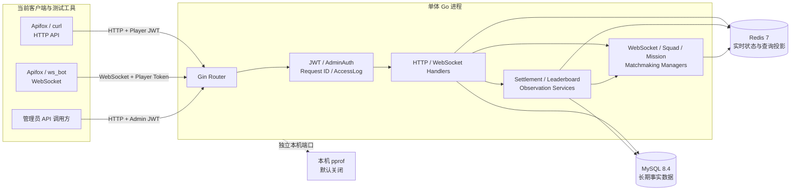
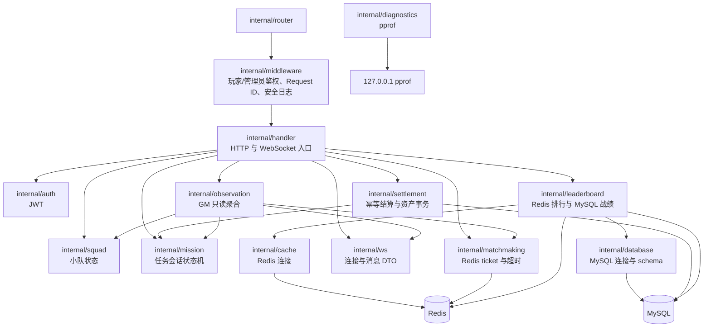
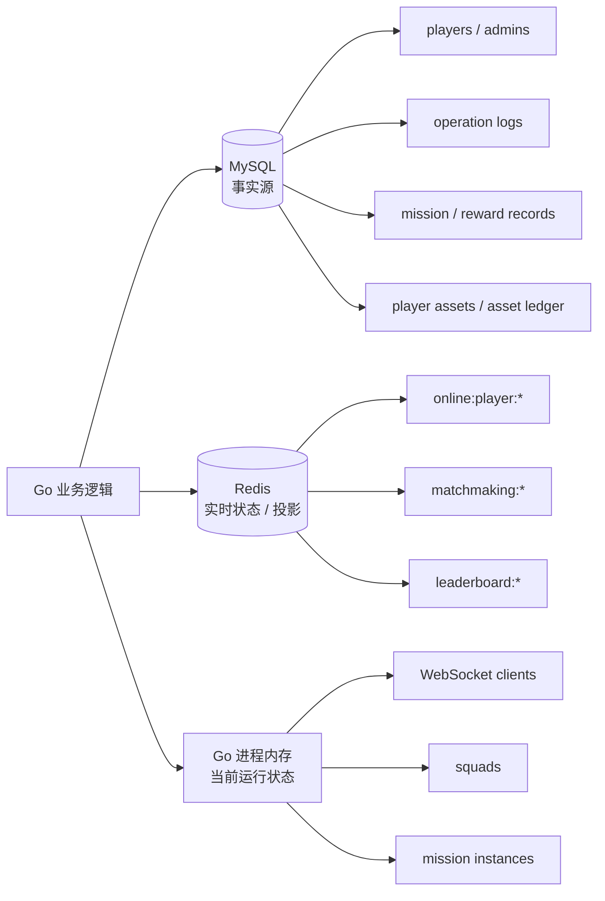

# 当前系统架构

> 状态：已实现架构
> 最后更新：2026-08-23
> 适用范围：公开项目文档 / 一期成果

## 架构范围

本文只描述当前仓库已经实现并验证的单体 Go 游戏业务服务。

当前系统不是完整商业战斗服，也没有 React GM 页面、Unity 客户端、独立 Dedicated Server、微服务或 Kubernetes。

## 运行拓扑



## 进程内模块



## 模块职责

| 模块 | 当前职责 |
| --- | --- |
| `auth` | 玩家和管理员 JWT 生成、解析与身份类型区分 |
| `middleware` | 玩家/管理员鉴权、Request ID、安全访问日志 |
| `handler` | HTTP 参数解析、状态码、WebSocket 消息分发 |
| `ws` | 连接注册、重复连接替换、发送锁、协议 DTO |
| `squad` | 小队成员、队长、ready、在线状态和离队解散 |
| `mission` | 任务会话生命周期和合法状态迁移 |
| `matchmaking` | Redis ticket、任务队列、玩家索引和超时索引 |
| `settlement` | 服务端结算、幂等、防重放、资产强事务 |
| `leaderboard` | Redis 最佳分投影、同分排序和 MySQL 战绩查询 |
| `observation` | 聚合当前进程、Redis 和 MySQL 的 GM 只读视图 |
| `diagnostics` | 默认关闭的本机 pprof 服务 |

## 数据职责



| 存储 | 适合的数据 | 当前限制 |
| --- | --- | --- |
| MySQL | 账号、管理员、审计、结算、奖励、余额、流水 | 需要事务、唯一约束和迁移管理 |
| Redis | 在线 TTL、匹配 ticket、等待队列、排行榜投影 | 不是核心资产唯一事实源 |
| Go 内存 | WebSocket、小队、任务会话当前状态 | 单实例，服务重启后清空 |

## 一致性边界

### 结算与资产

```text
MySQL transaction
  mission_records
  reward_records
  player_assets
  asset_ledger
```

四类写入在同一个事务中提交或回滚。`mission_instance_id`、`idempotency_key` 和玩家 nonce 提供三层唯一约束。

### 排行榜

```text
MySQL settled result
  -> transaction commit
  -> best-effort Redis leaderboard projection
```

Redis 排行榜可重建，不参与资产入账。同步失败不会回滚已经成功的 MySQL 资产事务。

### GM 摘要

GM 摘要依次读取当前进程 Manager、Redis 和 MySQL，是带 `observed_at` 的近实时视图，不是跨组件原子快照。

## 安全边界

- 玩家 token 和管理员 token 使用不同 subject type。
- `/api/admin/*` 只接受管理员 token。
- WebSocket 只接受玩家 token。
- 密码只保存 bcrypt hash。
- SQL 使用参数占位符。
- 危险 GM 写操作记录数据库审计。
- AccessLog 不记录 query、Authorization 或 body。
- 正常访问日志不会记录 WebSocket query token。
- 服务端不逐条记录高频原始 WebSocket payload。
- Request ID 只用于日志关联，不用于鉴权或结算幂等。

## 诊断边界

pprof：

- 默认关闭。
- 使用独立 `127.0.0.1` 端口。
- 不注册到业务 Gin Router。
- 原始 profile 保存在仓库外。
- 只用于本机诊断，不是监控或公网管理接口。

## 当前部署模型

```text
Windows 开发机
  Docker Desktop
    MySQL 8.4
    Redis 7
  Go server process
  ws_bot / Apifox
```

当前没有多实例、负载均衡、服务发现、容器化 Go 服务或自动扩缩容。

## 当前非目标

- 逐帧战斗模拟。
- 物理、技能命中和怪物 AI。
- 客户端预测与延迟补偿。
- 完整匹配撮合成功。
- 跨服和多实例状态同步。
- React GM 页面与 Unity Demo。
- 商业级容量和可用性承诺。

## 验证入口

- [API 与 WebSocket](api-overview.md)
- [关键数据流](data-flow.md)
- [一期能力总结](phase1-summary.md)
- [Day34 性能证据](performance/day34-baseline.md)
