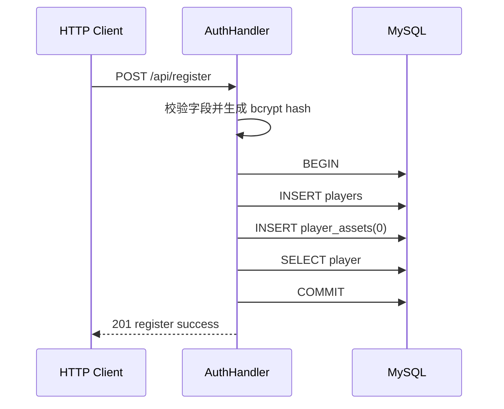
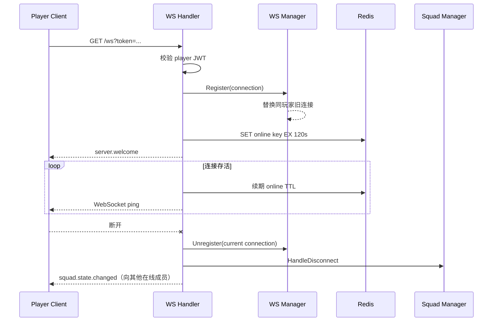
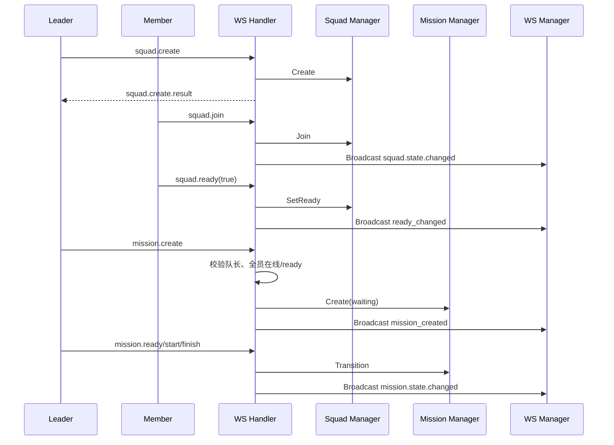
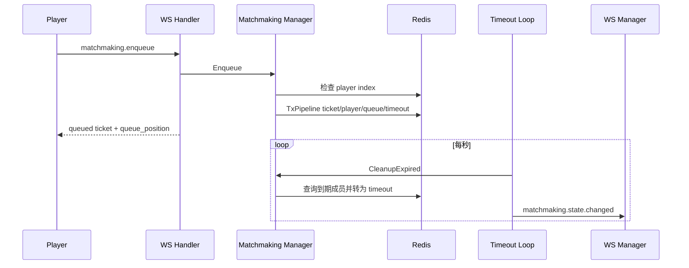
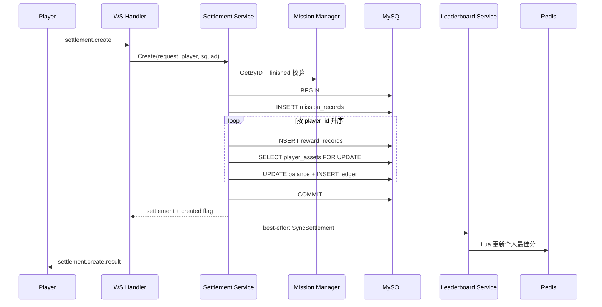
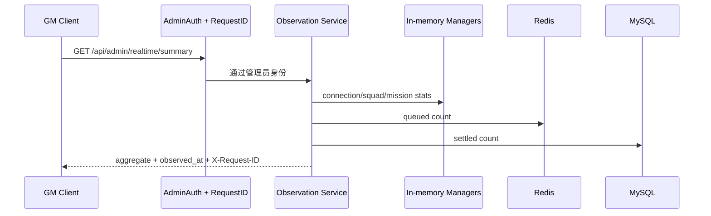

# 关键业务数据流

> 文档角色：跨模块时序与数据流说明
> 权威级别：L2（当前流程说明）
> 状态：已实现
> 适用范围：一期关键业务链路
> 事实来源：当前 Handler、Service、Manager、MySQL 与 Redis 调用顺序
> 最后更新：2026-08-31

本文只描述调用顺序；模块职责见 [系统详细设计](system-design.md)，字段契约见 [OpenAPI](openapi.yaml) 与 [WebSocket 协议](ws-protocol.md)。

## 1. 注册与初始资产

用户名唯一冲突返回 409；任一步失败都回滚，不产生只有账号没有资产行的正常新玩家。

## 2. WebSocket 在线与断线

Redis 在线 key 不在断开时立即删除，等待 TTL 过期，减少短暂断线抖动。访问日志只记录 `/ws` path，不记录 query。

## 3. 小队与任务会话

任务会话在 Go 内存中；`running` 仅表示业务生命周期，不表示存在独立战斗进程。

## 4. 匹配 ticket 与超时

当前没有 `matched` 状态或多名玩家撮合成功流程。

## 5. 幂等结算与排行榜

若唯一键表明请求已处理，Service 加载已有记录并返回，不重复发奖。若排行榜同步失败，已提交的 MySQL 资产仍是事实。

## 6. GM 观察

读操作跨三个数据源依次执行，因此是近实时聚合，不是原子快照。
