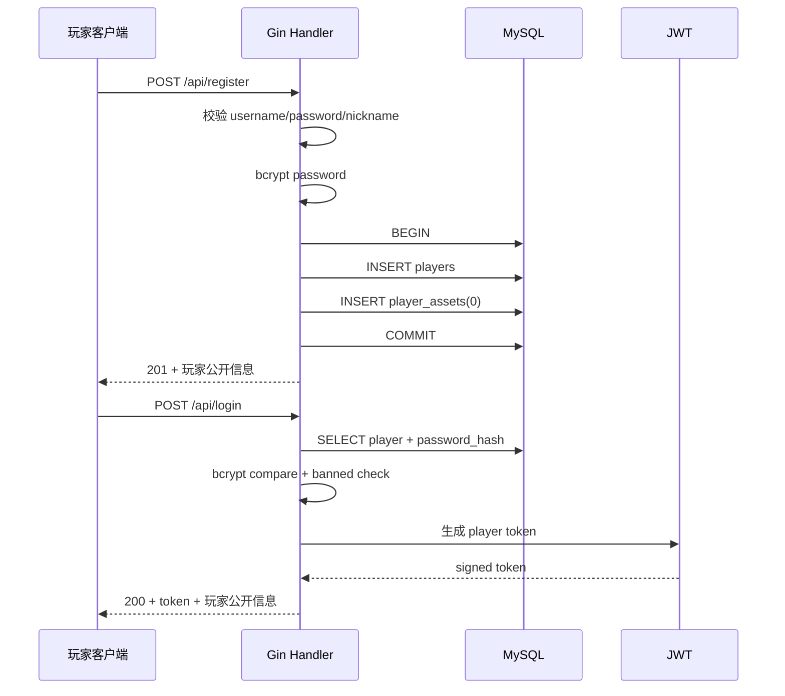
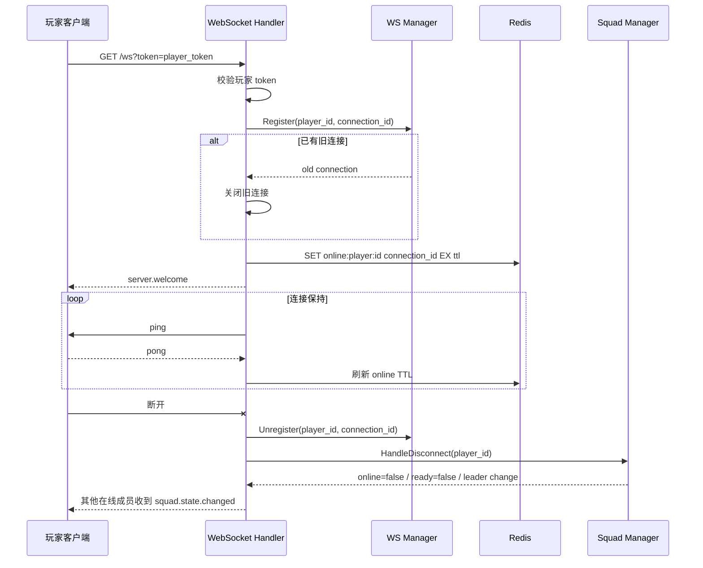
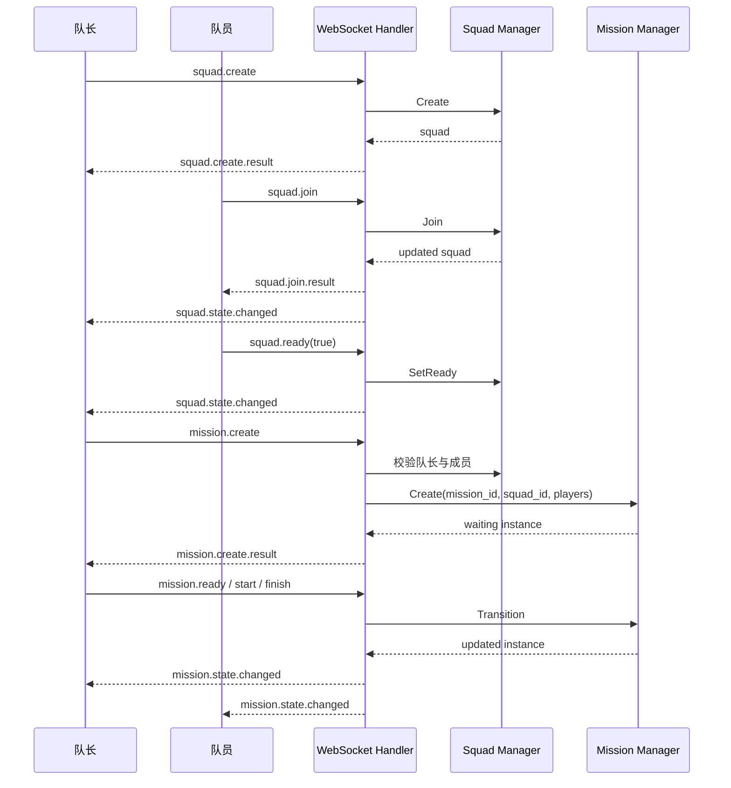
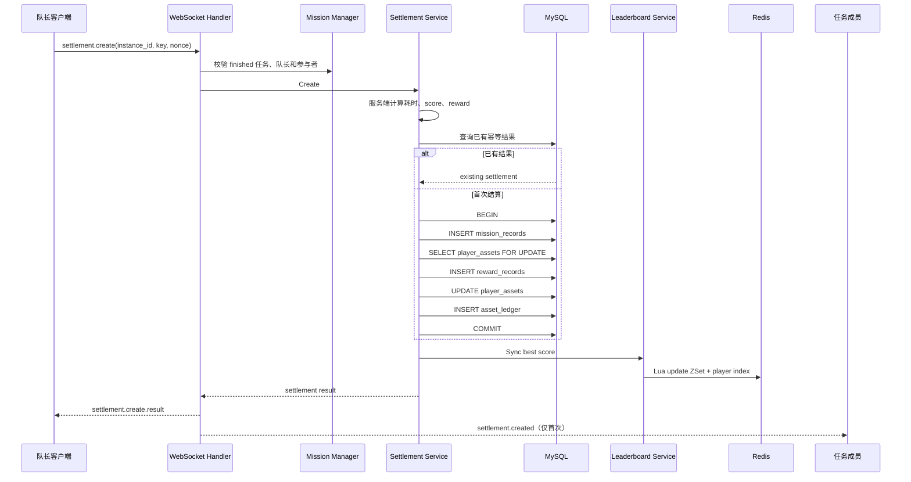
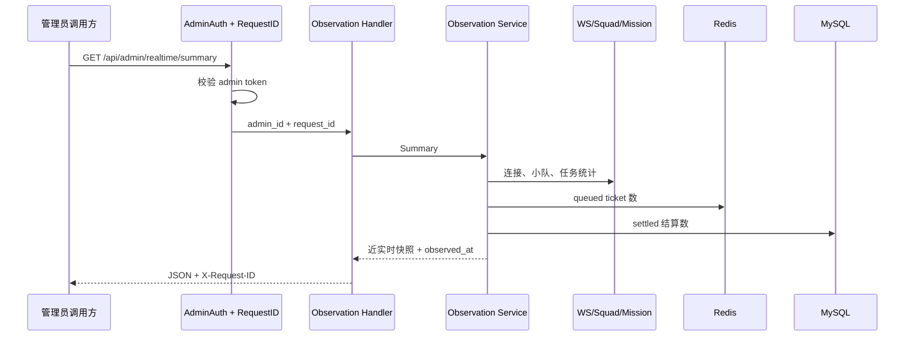
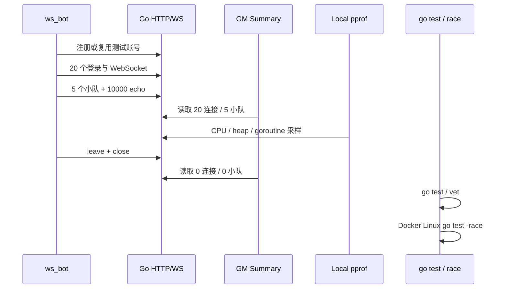

# 关键数据流

> 状态：已实现数据流
> 最后更新：2026-08-23
> 适用范围：公开项目文档 / 一期成果

## 阅读说明

本文描述当前单体 Go 服务已经实现的关键请求链路。

图中的 `mission_instance` 表示任务会话与结算生命周期元数据，不表示逐帧战斗模拟进程。

## 1. 注册与登录



关键点：

- 注册同时创建零余额资产行。
- password hash 不返回客户端。
- 被封禁玩家不能登录。
- token subject type 区分玩家和管理员。

## 2. WebSocket 与在线状态



关键点：

- 新连接替换旧连接。
- 旧连接断开时不能注销新连接。
- 在线状态通过 Redis TTL 自动过期。
- AccessLog 只记录 path，不记录 query token。

## 3. 小队与任务会话



合法状态：

```text
waiting -> ready -> running -> finished
waiting -> canceled
```

任务会话只管理业务生命周期，不处理物理、技能、AI 或命中。

## 4. 匹配 ticket

```mermaid
sequenceDiagram
    participant Player as 玩家
    participant WS as WebSocket Handler
    participant Match as Matchmaking Manager
    participant Redis as Redis
    participant Loop as Timeout Loop

    Player->>WS: matchmaking.enqueue
    WS->>Match: Enqueue(mission_id, role)
    Match->>Redis: HSET ticket
    Match->>Redis: ZADD mission queue
    Match->>Redis: ZADD timeout index
    Match->>Redis: SET player -> ticket
    Match-->>WS: queued ticket + queue position
    WS-->>Player: matchmaking.enqueue.result

    alt 玩家取消
        Player->>WS: matchmaking.cancel
        WS->>Match: Cancel
        Match->>Redis: remove queue + timeout
        WS-->>Player: canceled result
    else 到期
        Loop->>Redis: 扫描 timeout index
        Loop->>Match: CleanupExpired
        Match->>Redis: remove queue + timeout
        WS-->>Player: matchmaking.state.changed(timeout)
    end
```

当前只实现 queued、canceled 和 timeout，没有 matched 撮合成功算法。

## 5. 幂等结算、资产与排行榜



幂等防线：

```text
UNIQUE mission_instance_id
UNIQUE idempotency_key
UNIQUE submitted_by_player_id + nonce
```

MySQL 是结算和资产事实源。Redis 排行榜是提交后 best-effort 更新的可重建查询投影。

## 6. GM 只读观察



GM 观察是单实例、近实时、非跨组件原子快照。只读轮询写标准日志，不写高频 `admin_operation_logs`。

## 7. Day34 工程验证



完整实测见 [Day34 性能基线](performance/day34-baseline.md)。

## 数据流共同规则

- 客户端输入先校验，再进入业务层。
- 所有 SQL 使用参数化查询。
- WebSocket 请求和响应使用 `request_id` 关联。
- 核心资产只能由服务端计算并在 MySQL 事务中提交。
- Redis 数据必须允许超时、清理或重建。
- Manager 对外返回复制后的 DTO 或统计，不暴露锁、map 和连接对象。
