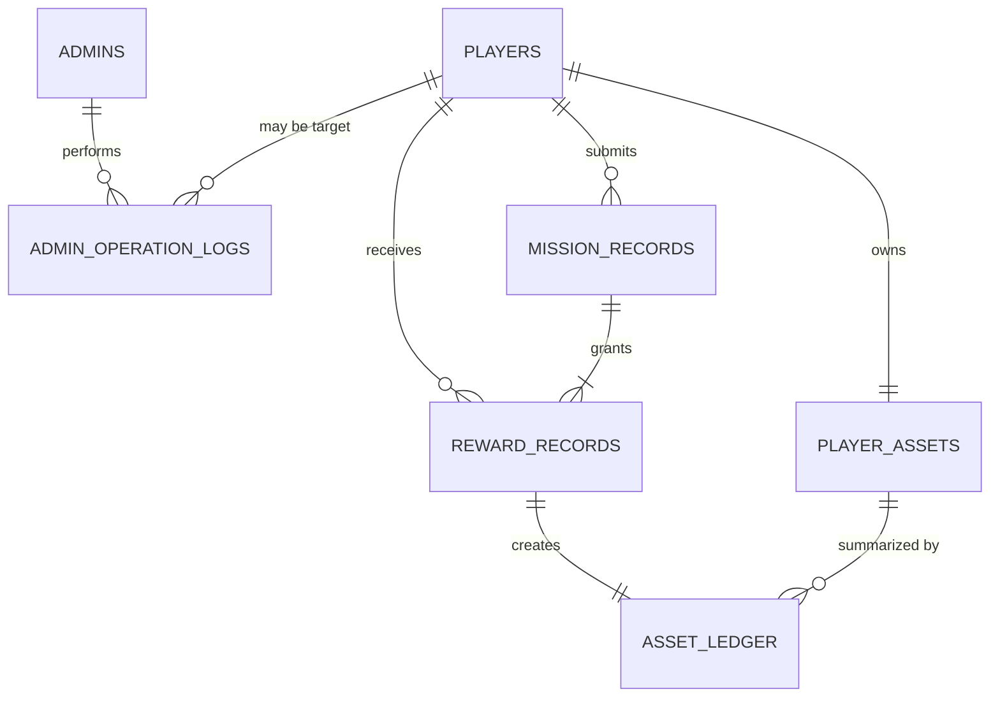

# 数据库与状态存储设计

> 文档角色：MySQL、Redis 与进程内状态的数据模型
> 权威级别：L1（数据设计事实源）
> 状态：已实现
> 适用范围：legacy 与 V2 单实例环境
> 事实来源：`schema.sql`、Day31 migration、SQL 查询、Redis 实现与 Manager 结构
> 最后更新：2026-10-10

## 1. 存储原则

第1—9节保留 legacy 数据事实；第10—11节记录 V2 新增表、资产扩展和运行约束。

当前默认 V2 以 MySQL 保存业务事实。day37基础、day38产品、day39归档、day40维护使用编号SQL与checksum账本；维护准入与幂等控制回执持久化。冻结legacy战绩按原Asia/Shanghai解释，V2时间为UTC，不批量修改历史行；Redis只保存 `v2:` 投影，旧匹配key仅按白名单清理。详见 [R4实施](design/v2-r4-implementation.md)。

- MySQL 保存长期事实、审计和资产事务。
- Redis 保存高频、短期或可从 MySQL/客户端重建的状态与查询投影。
- Go 内存保存只属于当前进程的连接、小队和任务会话。
- 逐帧位置、物理、技能或 AI 状态不进入当前业务表。

## 2. 逻辑 ERD

当前 schema 没有声明物理外键；下图表示应用层逻辑关系。

未使用外键的当前原因是学习阶段保持初始化简单；代价是删除/修复数据时必须由应用或运维流程保证关系一致。若未来开放通用删除、自动归档或多人协作迁移，应重新评估外键和级联策略。

## 3. 表级数据字典

### 3.1 `players`

| 字段 | 类型/空值 | 含义与约束 |
| --- | --- | --- |
| `id` | `BIGINT`, PK, auto increment | 玩家身份 |
| `username` | `VARCHAR(64)`, NOT NULL, UNIQUE | 登录名，排序规则下不区分大小写 |
| `password_hash` | `VARCHAR(255)`, NOT NULL | bcrypt hash，不返回 API |
| `nickname` | `VARCHAR(64)`, NOT NULL | 展示昵称 |
| `status` | `VARCHAR(32)`, default `normal` | 当前使用 `normal`/`banned` |
| `banned_reason` | `TEXT`, NOT NULL | 未封禁时为空字符串 |
| `banned_at` | `DATETIME(3)`, nullable | 封禁时间 |
| `banned_by_admin_id` | `BIGINT`, nullable | 执行封禁的管理员 ID，逻辑引用 |
| `created_at` / `updated_at` | `DATETIME(3)` | 创建与业务更新时间 |

注册时同时在 `player_assets` 创建零余额行；两步属于同一个 MySQL 事务。

### 3.2 `player_assets`

| 字段 | 类型/空值 | 含义与约束 |
| --- | --- | --- |
| `player_id` | `BIGINT`, PK | 每名玩家一行，逻辑引用 `players.id` |
| `soft_currency` | `BIGINT`, default `0` | 当前软货币余额快照 |
| `created_at` / `updated_at` | `DATETIME(3)` | 资产行时间 |

结算事务使用 `SELECT ... FOR UPDATE` 锁定该行。余额快照用于快速读取，变更历史以 `asset_ledger` 为准。

### 3.3 `admins`

| 字段 | 类型/空值 | 含义与约束 |
| --- | --- | --- |
| `id` | `BIGINT`, PK, auto increment | 管理员身份 |
| `username` | `VARCHAR(64)`, UNIQUE | 管理员登录名 |
| `password_hash` | `VARCHAR(255)` | bcrypt hash |
| `display_name` | `VARCHAR(64)` | 展示名称 |
| `role` | `VARCHAR(32)`, default `gm` | 写入 JWT 的角色信息 |
| `created_at` / `updated_at` | `DATETIME(3)` | 记录时间 |

当前 AdminAuth 只区分管理员 subject，不按 role 实施细粒度接口授权；这属于安全缺口而不是完整 RBAC。

### 3.4 `admin_operation_logs`

| 字段组 | 含义 |
| --- | --- |
| `id`, `created_at` | 审计身份与时间 |
| `admin_id`, `admin_username`, `admin_role` | 操作者快照 |
| `action`, `target_type`, `target_id` | 动作和目标 |
| `detail` | 业务说明，例如封禁原因 |
| `ip`, `user_agent` | 请求来源信息 |

封禁/解封使用同一事务写玩家状态和审计记录。玩家列表/详情查询会 best-effort 写审计；写失败只记录服务端日志，不回滚读取结果。

### 3.5 `mission_records`

| 字段 | 含义与约束 |
| --- | --- |
| `id` | 结算记录主键 |
| `mission_instance_id` | 任务会话 ID，UNIQUE；一个任务只能有一份结算 |
| `mission_id`, `squad_id` | 任务模板与小队快照 |
| `submitted_by_player_id` | 首次提交结算的玩家 |
| `nonce` | 与提交玩家组成 UNIQUE，防止跨任务重放 |
| `idempotency_key` | UNIQUE，支持请求重试并检测跨任务复用 |
| `status` | 当前新记录固定为 `settled` |
| `completion_seconds`, `score` | 服务端根据内存任务时间计算 |
| `created_at`, `updated_at` | 记录时间 |

该表保存已结算结果，不持久化当前任务会话状态机。

### 3.6 `reward_records`

| 字段 | 含义与约束 |
| --- | --- |
| `id` | 奖励记录主键 |
| `mission_record_id`, `mission_instance_id` | 关联结算快照 |
| `player_id` | 奖励接收者 |
| `reward_type`, `amount` | 当前奖励类型和数量 |
| `status` | 当前新记录固定为 `granted` |
| `granted_at` | 与资产写入同事务的授予时间 |
| `created_at`, `updated_at` | 记录时间 |

`(mission_record_id, player_id, reward_type)` UNIQUE 防止同一结果为同一玩家重复发放同类奖励。

### 3.7 `asset_ledger`

| 字段组 | 含义与约束 |
| --- | --- |
| `id`, `created_at` | 流水身份与时间 |
| `player_id`, `mission_record_id`, `reward_record_id` | 玩家、结算与奖励关联 |
| `mission_instance_id` | 任务会话快照 |
| `asset_type`, `delta` | 资产类型与本次变化 |
| `balance_before`, `balance_after` | 变化前后余额 |
| `reason` | 业务原因 |

`reward_record_id` UNIQUE，保证一条 reward 只生成一条资产流水。正常业务将流水视为 append-only；撤销应新增补偿流水而不是改写历史。

## 4. 索引目录

| 表 | 索引/约束 | 用途 |
| --- | --- | --- |
| `players` | `uq_players_username` | 注册唯一性与登录查询 |
| `players` | `idx_players_status` | 玩家状态统计/筛选 |
| `admins` | `uq_admins_username` | 管理员登录 |
| `admin_operation_logs` | admin/action/created_at 单列索引 | 常用审计筛选和倒序查看 |
| `mission_records` | instance、idempotency、player+nonce 三组 UNIQUE | 业务幂等与防重放 |
| `mission_records` | player、created_at 索引 | 玩家提交与时间查询 |
| `reward_records` | mission+player+type UNIQUE | 发奖幂等 |
| `reward_records` | mission record、instance、player、status 索引 | 参与者、结果和状态查询 |
| `asset_ledger` | reward UNIQUE | 一奖励一流水 |
| `asset_ledger` | player、mission record、instance、created_at 索引 | 审计与追踪 |

当前部分多条件查询依赖单列索引组合或扫描；没有基于生产数据量做联合索引调优。新增索引必须先保存 `EXPLAIN` 和真实查询证据。

## 5. 事务边界

| 业务 | 同一事务内操作 |
| --- | --- |
| 注册 | 插入 `players` + 插入 `player_assets` |
| 封禁/解封 | 更新 `players` + 插入 `admin_operation_logs` |
| 结算 | `mission_records` + `reward_records` + 锁/更新 `player_assets` + `asset_ledger` |

MySQL 事务不包含 Redis。排行榜采用“先提交事实、后更新投影”；当前没有 Outbox 或自动重放任务。

## 6. Redis key 目录

| Key | 类型 | 生命周期/用途 |
| --- | --- | --- |
| `online:player:<id>` | String | 120 秒 TTL，HTTP/WS 在线状态 |
| `matchmaking:ticket:<ticket_id>` | Hash | ticket 字段，终态短期保留 10 分钟 |
| `matchmaking:player:<player_id>` | String | 玩家到最近 ticket 的索引，短期保留 |
| `matchmaking:queue:<mission_id>` | ZSet | 按创建时间排队 |
| `matchmaking:timeouts` | ZSet | 全局到期索引，member 含任务与 ticket |
| `leaderboard:{<mission_id>}:scores` | ZSet | 个人最佳分与同分顺序 |
| `leaderboard:{<mission_id>}:players` | Hash | 玩家到当前最佳 member 的索引 |

排行榜两个 key 使用相同 hash tag，Lua 脚本原子更新。当前排行榜无 TTL、赛季和自动重建任务。

## 7. 进程内状态

| 状态 | 结构 | 重启行为 |
| --- | --- | --- |
| WebSocket 连接 | `map[player_id]*Client` | 全部断开并丢失 |
| 小队 | squad map + player index | 全部清空 |
| 任务会话 | instance map + squad/player index | 全部清空 |

因此当前不能宣称会话恢复、多实例共享、全服一致性或无状态水平扩展。

## 8. 初始化与迁移台账

- `backend/internal/database/schema.sql`：新环境全量初始化的当前 schema。
- `backend/internal/database/migrations/day31_settlement_assets.sql`：从 Day30 结构升级到 Day31 资产事务结构。
- `backend/internal/database/seed.sql`：幂等创建本地管理员。

V2 使用 `cmd/tools/v2_migrate` 和 `schema_migrations`，仍沿用编号 SQL。版本/checksum 与 running/applied/reconciled/failed 记录控制单次执行；工具核对 V2 所需表、列、索引及 ledger兼容改动，异常拒绝。MySQL DDL 不支持整个文件事务回滚；dirty 状态需恢复或修复，不盲目续跑。legacy 历史 SQL 不自动补造迁移记录。

## 9. 保留、归档与删除

- legacy没有自动归档；V2私聊正文按窗口分批清理，其他历史按 [归档与维护规则](design/v2-r4-implementation.md) 保留去重、参战、结果、奖励、审计和待处理依据，不自动销毁。
- `asset_ledger` 和危险 GM 审计应按 append-only 思路维护。
- 本地测试数据可以按明确玩家前缀和关联顺序清理，但不能把该流程描述成生产删除策略。
- 备份文件、dump、日志和 profile 不提交 Git，具体见 [备份与恢复](backup-and-recovery.md)。
- RPO/RTO 尚未正式承诺。

## 10. V2 持久化事实与投影

V2 增量表由 `backend/internal/database/migrations/day37_v2_pve_foundation.sql` 创建，包含社交、Party、邀请/招募、票据/候选、活动占用、规则版本、Run/参与者、事件/目标、任务尝试、增援、逐人结果、奖励和 pending/outbox。V2 不迁移一期 `mission_records`，而是保留 `run_id`、`participant_id`、任务尝试和奖励来源唯一键；软货币仍在 `player_assets` 中更新，V2 流水使用 `asset_ledger.pve_grant_id/pve_run_id`。

R2增量 `day38_v2_product_model.sql` 增加续组申请/成员响应、招募成员独立准备、票据规则/来源版本、周期任务进度与一次性完成唯一键、停用标记和贡献证据。续组申请只在全员同意、版本/活动锁复核后迁移；招募玩家不写`pve_party_members`，整组排队时形成独立来源票据。R2迁移必须先执行day37并通过账本，再以`v2_migrate -stage r2`执行day38。

V2 规则 JSON 的版本和内容 hash 存入 `pve_rule_versions`，Run 在创建时保存完整规则快照。`pve_run_events` 用 `event_id`、`source`、`source_generation`、`sequence_no` 和 fingerprint 防重放；事件应用、任务进度和奖励来源均有唯一约束。

`pve_participant_results`、`pve_reward_grants`、`player_assets`、`asset_ledger` 按人事务提交，Run终态保存在 `pve_runs`；`FinalizeRun` 检查全员结果。修复请求以 `repair:<operation_id>` 在 `pve_pending_operations` 保存 done/repair_audit 回执与指纹，和原操作复排及 `admin_operation_logs` 一起提交；Worker只处理未完成结算操作。

V2 Redis key 统一使用 `v2:` 前缀：`v2:queue:training_ground` 和 `v2:rewards` 是可重建投影。删除 Redis 不改变 MySQL 活动、Run、任务或资产事实，Worker/投影重建可以重新建立索引。

## 11. V2 运行事实补充

V2 启动时对数据库申请 `GET_LOCK('gm-gameplay:<database>')`，同一数据库只允许一个玩法进程写入；服务停止释放连接锁。V2 数据库连接使用 UTC 解析时间，legacy 继续使用既有开发时区配置。该锁是当前单实例学习环境的保护，不是多实例协调方案。

锁持有连接每秒复核锁归属，连接或锁丢失时停止进程；这仍不是分布式fencing协议。冻结的 legacy `mission_records` DATETIME 按原 Asia/Shanghai 墙上时间解释，玩家历史和GM历史结算不会因V2连接UTC解析而偏移；不修改旧数据。V2 Run、任务、奖励与维护事实继续使用UTC。共用玩家/审计表的历史混合时间仍需按原写入来源核对，不能批量转换旧行。

## 12. 历史与非目标

PostgreSQL 是早期学习历史，不是当前运行依赖。当前不做分库分表、读写分离、自动故障转移、跨区域灾备、逐帧状态持久化，也不允许未来局内服务绕过 Go 业务链路直接修改资产表。

R2 `day38_v2_product_model.sql` 已在独立测试库、真实备份恢复副本和本机开发库执行；两次运行均为 `applied`。R2备份恢复副本与原库旧数据摘要一致，2名玩家/2行资产/总余额0保持。后续环境仍需先备份恢复副本再执行 `V2_MIGRATION_CONFIRM=I_UNDERSTAND_V2_MIGRATION go run ./cmd/tools/v2_migrate -stage r2`，失败时按账本恢复，不通过删除或手工修改周期完成/奖励事实绕过账本。

## 13. R5 实验数据隔离

本机验收只对独立 `game_realtime_v2_test` 合成数据做备份，恢复到 `game_realtime_v2_r5_restore`。`002_source_views.sql` 在恢复副本提供 `r5_runs/results/outbox/leaderboard` 四个有限视图，Reader 仅 SELECT 视图，无原玩家表、资产、Run 或 outbox 写权限。

独立 `game_realtime_r5_reports` 使用编号 `001_reporting.sql`，包含 `r5_scan_state`、`r5_deliveries`、`r5_receipts`、`r5_report_runs`。消息 ID 使用 binary collation；receipt 保存 payload hash 和完整 envelope fingerprint；报表以 source/run 唯一，投递重试不改主事实。Projector 只被授予独立库 CRUD，无主库权限。两份 SQL 不加入主 day37—40 迁移，也不迁移一期历史或开发数据。重新创建实验副本必须重建限定视图和账号，不以这些临时视图替代正式生产只读设计。
