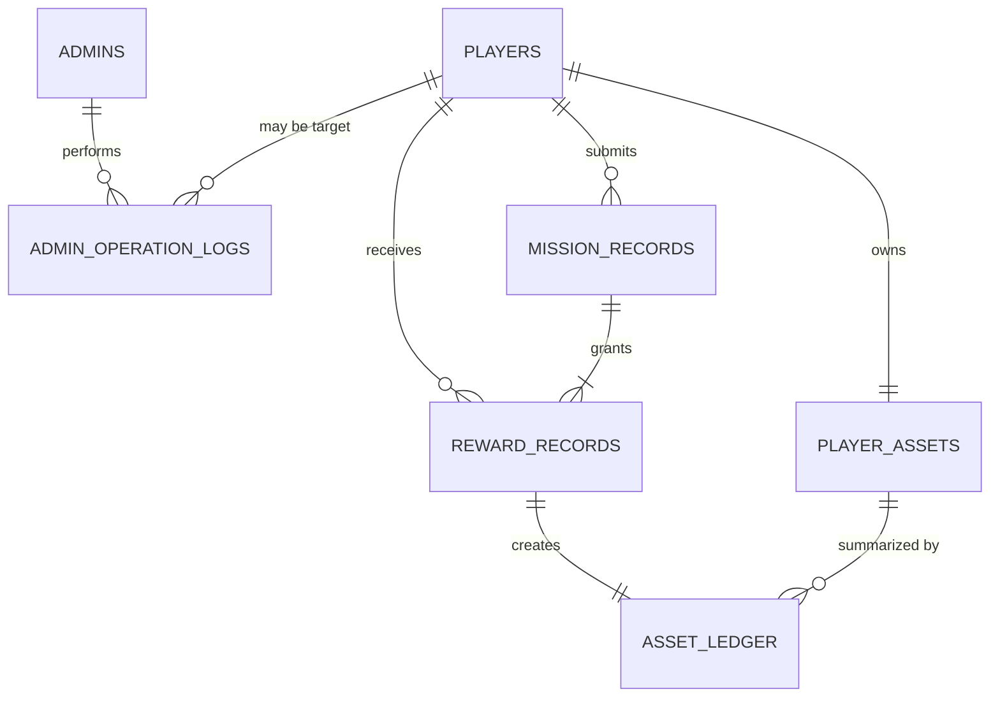

# 数据库与状态存储设计

> 文档角色：MySQL、Redis 与进程内状态的数据模型
> 权威级别：L1（数据设计事实源）
> 状态：已实现
> 适用范围：legacy历史与V2/R4单实例事实
> 事实来源：`schema.sql`、Day31 migration、SQL 查询、Redis 实现与 Manager 结构
> 最后更新：2026-10-08

## V2/R4补充

V2新增 `pve_*` 事实表并与legacy共用player_assets/asset_ledger。day37基础、day38产品、day39归档、day40维护沿用编号SQL与checksum账本；新增`pve_service_control`和`pve_control_operations`，状态、版本与幂等回执持久化。归档保留事件指纹/序号、奖励键、参与者、账本与修复审计。V2时间使用UTC，冻结legacy战绩按原Asia/Shanghai解释，不修改旧行。Redis使用`v2:`投影，仅白名单清理旧匹配key；第1—9节为legacy存储记录。见 [R4实施](design/v2-r4-implementation.md)。

## 1. 存储原则

- MySQL 保存长期事实、审计和资产事务。
- Redis 保存高频、短期或可从 MySQL/客户端重建的状态与查询投影。
- Go 内存保存只属于当前进程的连接、小队和任务会话。
- 逐帧位置、物理、技能或 AI 状态不进入当前业务表。

## 2. 逻辑 ERD

当前 schema 没有声明物理外键；下图表示应用层逻辑关系。

未使用外键的当前原因是学习阶段保持初始化简单；代价是删除/修复数据时必须由应用或运维流程保证关系一致。若未来开放通用删除、自动归档或多人协作迁移，应重新评估外键和级联策略。

## 3. 表级数据字典

### 3.1 `players`

| 字段 | 类型/空值 | 含义与约束 |
| --- | --- | --- |
| `id` | `BIGINT`, PK, auto increment | 玩家身份 |
| `username` | `VARCHAR(64)`, NOT NULL, UNIQUE | 登录名，排序规则下不区分大小写 |
| `password_hash` | `VARCHAR(255)`, NOT NULL | bcrypt hash，不返回 API |
| `nickname` | `VARCHAR(64)`, NOT NULL | 展示昵称 |
| `status` | `VARCHAR(32)`, default `normal` | 当前使用 `normal`/`banned` |
| `banned_reason` | `TEXT`, NOT NULL | 未封禁时为空字符串 |
| `banned_at` | `DATETIME(3)`, nullable | 封禁时间 |
| `banned_by_admin_id` | `BIGINT`, nullable | 执行封禁的管理员 ID，逻辑引用 |
| `created_at` / `updated_at` | `DATETIME(3)` | 创建与业务更新时间 |

注册时同时在 `player_assets` 创建零余额行；两步属于同一个 MySQL 事务。

### 3.2 `player_assets`

| 字段 | 类型/空值 | 含义与约束 |
| --- | --- | --- |
| `player_id` | `BIGINT`, PK | 每名玩家一行，逻辑引用 `players.id` |
| `soft_currency` | `BIGINT`, default `0` | 当前软货币余额快照 |
| `created_at` / `updated_at` | `DATETIME(3)` | 资产行时间 |

结算事务使用 `SELECT ... FOR UPDATE` 锁定该行。余额快照用于快速读取，变更历史以 `asset_ledger` 为准。

### 3.3 `admins`

| 字段 | 类型/空值 | 含义与约束 |
| --- | --- | --- |
| `id` | `BIGINT`, PK, auto increment | 管理员身份 |
| `username` | `VARCHAR(64)`, UNIQUE | 管理员登录名 |
| `password_hash` | `VARCHAR(255)` | bcrypt hash |
| `display_name` | `VARCHAR(64)` | 展示名称 |
| `role` | `VARCHAR(32)`, default `gm` | 写入 JWT 的角色信息 |
| `created_at` / `updated_at` | `DATETIME(3)` | 记录时间 |

当前 AdminAuth 只区分管理员 subject，不按 role 实施细粒度接口授权；这属于安全缺口而不是完整 RBAC。

### 3.4 `admin_operation_logs`

| 字段组 | 含义 |
| --- | --- |
| `id`, `created_at` | 审计身份与时间 |
| `admin_id`, `admin_username`, `admin_role` | 操作者快照 |
| `action`, `target_type`, `target_id` | 动作和目标 |
| `detail` | 业务说明，例如封禁原因 |
| `ip`, `user_agent` | 请求来源信息 |

封禁/解封使用同一事务写玩家状态和审计记录。玩家列表/详情查询会 best-effort 写审计；写失败只记录服务端日志，不回滚读取结果。

### 3.5 `mission_records`

| 字段 | 含义与约束 |
| --- | --- |
| `id` | 结算记录主键 |
| `mission_instance_id` | 任务会话 ID，UNIQUE；一个任务只能有一份结算 |
| `mission_id`, `squad_id` | 任务模板与小队快照 |
| `submitted_by_player_id` | 首次提交结算的玩家 |
| `nonce` | 与提交玩家组成 UNIQUE，防止跨任务重放 |
| `idempotency_key` | UNIQUE，支持请求重试并检测跨任务复用 |
| `status` | 当前新记录固定为 `settled` |
| `completion_seconds`, `score` | 服务端根据内存任务时间计算 |
| `created_at`, `updated_at` | 记录时间 |

该表保存已结算结果，不持久化当前任务会话状态机。

### 3.6 `reward_records`

| 字段 | 含义与约束 |
| --- | --- |
| `id` | 奖励记录主键 |
| `mission_record_id`, `mission_instance_id` | 关联结算快照 |
| `player_id` | 奖励接收者 |
| `reward_type`, `amount` | 当前奖励类型和数量 |
| `status` | 当前新记录固定为 `granted` |
| `granted_at` | 与资产写入同事务的授予时间 |
| `created_at`, `updated_at` | 记录时间 |

`(mission_record_id, player_id, reward_type)` UNIQUE 防止同一结果为同一玩家重复发放同类奖励。

### 3.7 `asset_ledger`

| 字段组 | 含义与约束 |
| --- | --- |
| `id`, `created_at` | 流水身份与时间 |
| `player_id`, `mission_record_id`, `reward_record_id` | 玩家、结算与奖励关联 |
| `mission_instance_id` | 任务会话快照 |
| `asset_type`, `delta` | 资产类型与本次变化 |
| `balance_before`, `balance_after` | 变化前后余额 |
| `reason` | 业务原因 |

`reward_record_id` UNIQUE，保证一条 reward 只生成一条资产流水。正常业务将流水视为 append-only；撤销应新增补偿流水而不是改写历史。

## 4. 索引目录

| 表 | 索引/约束 | 用途 |
| --- | --- | --- |
| `players` | `uq_players_username` | 注册唯一性与登录查询 |
| `players` | `idx_players_status` | 玩家状态统计/筛选 |
| `admins` | `uq_admins_username` | 管理员登录 |
| `admin_operation_logs` | admin/action/created_at 单列索引 | 常用审计筛选和倒序查看 |
| `mission_records` | instance、idempotency、player+nonce 三组 UNIQUE | 业务幂等与防重放 |
| `mission_records` | player、created_at 索引 | 玩家提交与时间查询 |
| `reward_records` | mission+player+type UNIQUE | 发奖幂等 |
| `reward_records` | mission record、instance、player、status 索引 | 参与者、结果和状态查询 |
| `asset_ledger` | reward UNIQUE | 一奖励一流水 |
| `asset_ledger` | player、mission record、instance、created_at 索引 | 审计与追踪 |

当前部分多条件查询依赖单列索引组合或扫描；没有基于生产数据量做联合索引调优。新增索引必须先保存 `EXPLAIN` 和真实查询证据。

## 5. 事务边界

| 业务 | 同一事务内操作 |
| --- | --- |
| 注册 | 插入 `players` + 插入 `player_assets` |
| 封禁/解封 | 更新 `players` + 插入 `admin_operation_logs` |
| 结算 | `mission_records` + `reward_records` + 锁/更新 `player_assets` + `asset_ledger` |

MySQL 事务不包含 Redis。排行榜采用“先提交事实、后更新投影”；当前没有 Outbox 或自动重放任务。

## 6. Redis key 目录

| Key | 类型 | 生命周期/用途 |
| --- | --- | --- |
| `online:player:<id>` | String | 120 秒 TTL，HTTP/WS 在线状态 |
| `matchmaking:ticket:<ticket_id>` | Hash | ticket 字段，终态短期保留 10 分钟 |
| `matchmaking:player:<player_id>` | String | 玩家到最近 ticket 的索引，短期保留 |
| `matchmaking:queue:<mission_id>` | ZSet | 按创建时间排队 |
| `matchmaking:timeouts` | ZSet | 全局到期索引，member 含任务与 ticket |
| `leaderboard:{<mission_id>}:scores` | ZSet | 个人最佳分与同分顺序 |
| `leaderboard:{<mission_id>}:players` | Hash | 玩家到当前最佳 member 的索引 |

排行榜两个 key 使用相同 hash tag，Lua 脚本原子更新。当前排行榜无 TTL、赛季和自动重建任务。

## 7. 进程内状态

| 状态 | 结构 | 重启行为 |
| --- | --- | --- |
| WebSocket 连接 | `map[player_id]*Client` | 全部断开并丢失 |
| 小队 | squad map + player index | 全部清空 |
| 任务会话 | instance map + squad/player index | 全部清空 |

因此当前不能宣称会话恢复、多实例共享、全服一致性或无状态水平扩展。

## 8. 初始化与迁移台账

- `backend/internal/database/schema.sql`：新环境全量初始化的当前 schema。
- `backend/internal/database/migrations/day31_settlement_assets.sql`：从 Day30 结构升级到 Day31 资产事务结构。
- `backend/internal/database/seed.sql`：幂等创建本地管理员。

legacy历史SQL没有自动账本；V2使用`cmd/tools/v2_migrate -stage r4`、schema_migrations与checksum。执行前备份恢复确认目标，dirty/校验不一致拒绝；不承诺MySQL整份DDL事务回滚。

## 9. 保留、归档与删除

- legacy历史无自动归档；V2正文分批压缩且保留终态/去重/奖励依据，处理中的记录不压缩。
- `asset_ledger` 和危险 GM 审计应按 append-only 思路维护。
- 本地测试数据可以按明确玩家前缀和关联顺序清理，但不能把该流程描述成生产删除策略。
- 备份文件、dump、日志和 profile 不提交 Git，具体见 [备份与恢复](backup-and-recovery.md)。
- RPO/RTO 尚未正式承诺。

## 10. 历史与非目标

PostgreSQL 是早期学习历史，不是当前运行依赖。当前不做分库分表、读写分离、自动故障转移、跨区域灾备、逐帧状态持久化，也不允许未来局内服务绕过 Go 业务链路直接修改资产表。
