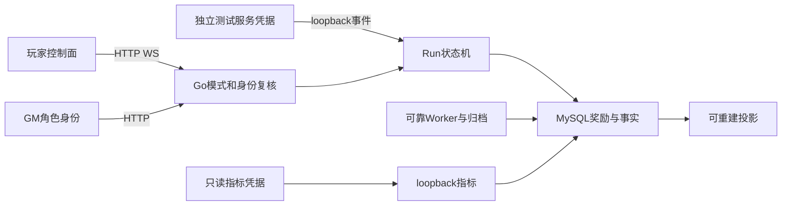

# R3发布与R4准备的安全边界

> 文档角色：发布范围、迁移和退役的风险分析
> 权威级别：L2
> 状态：本地学习/受控测试环境，不作公网生产审计
> 最后更新：2026-10-10

沿用已确认单实例合作PVE、不保存真实付费资产、内部事件只测试的边界。攻击者可访问玩家/管理员端口，不能假定其控制宿主机、Docker或MySQL。CI/Unity构建属于发布工具，不是运行时可信战斗来源。跨机器与共享公网条件改变时需重新评估。

| 风险/具体路径 | 影响与本地优先级 | 已有控制/发布约束 | 剩余边界 |
| --- | --- | --- | --- |
| Player继承Bot环境凭据后冒充受信来源 | 资产完整性高影响；测试工具误用概率中 | `deploy/verify-r3-unity.ps1`对子进程清除事件/指标/数据库/服务密钥，Bot保留在父进程；内部监听loopback和独立token | 拥有宿主机权限仍可获取本机测试凭据；生产服务身份留未来阶段 |
| 普通GM或过期角色执行重试/重复发奖 | 资产完整性高影响 | `V2Retry`在锁住待处理操作后，以同事务管理员共享锁复核operator；expected_attempts/status/Run、稳定修复键和审计同事务；并发重复请求不重复修复 | 修复数据仍由受控运维完成，不提供公开加币/注入事件 |
| 压缩事件后失去指纹，重放旧进度/奖励 | 资产完整性高影响 | `retention.Compact`只处理终态/无pending，保留事件fingerprint/代次/序号和奖励业务键；R3归档重复/冲突回归 | 小型去重行继续增长；无自动数据销毁承诺 |
| 退役误删旧账本/Redis共用key或回滚覆盖新资产 | 可用性/资产高影响，操作概率中 | R4已实现维护/排空和旧匹配key白名单；保留历史榜单/online/v2，恢复副本与实际R3进程回滚验证；不FLUSH、不用旧备份覆盖活动库 | 跨机器和共享环境观察窗口仍为门槛 |
| CI发布私人规则/日志/真实Secret | 机密性高影响 | 从main干净worktree精确导入；不合并不连通源历史；凭据pattern与清单审查，CI随机密码mask，最小contents:read | 本地开发默认凭据仍存在；共享部署必须替换，不能视为生产安全配置 |
| WS慢读/连接洪泛、指标大表扫描 | 可用性中影响 | V2 quota、命令限流、16KiB限制、有界发送队列/写超时，指标独立身份；Prometheus低基数 | 本机短时soak不证明公网容量，复杂压力/指标查询规模另验 |

证据位置：`backend/internal/handler/v2_transport.go`、`v2_repair.go`、`backend/internal/pve/retention/service.go`、`run/service.go`、`settlement/service.go`、`backend/internal/router/pve_internal.go`、`pve_metrics.go`和 `.github/workflows/verify.yml`。新增退役路径必须先验证R4清单，不能借发布PR执行旧入口删除。

## 2026-10-10 M7 就绪与验收补充

本轮沿用既有本机、单实例、合成数据和可信测试来源边界。`APP_HOST=127.0.0.1` 限定测试主端口；`/ready` 无需认证，但只返回通用 200/503，MySQL/Redis 使用共同一秒预算，不能泄露错误、地址或凭据。连接预算仍受原连接池约束；共享公网下的探针洪泛和强 Secret 准入需在共享部署前单独验证。

验收临时凭据由 Windows 用户 DPAPI 加密保存到仓库外受限目录；客户端与公开材料不接收事件/数据库密钥。数据库/Redis故障、旧版本进程、MQ崩溃和备份只作用于专用测试资源。本轮不改防火墙或 VPN，不恢复原开发数据库。Linux测试用回环端口转发仅在短期测试容器中连接隔离依赖，不新增玩家事件入口。

M7后社交复核证明按request行数计额度会被同一对玩家撤回/重发绕过，且响应与拉黑交错可重建active好友关系。改按稳定命令回执计成功次数、拒绝新意图重复pending，并以双方玩家锁协调关系变化；不存在或封禁玩家不能成为邀请目标。玩法服务open预算至少2，防止命名锁占满唯一连接造成启动不可用。失败/修复回归和实际进程证据见 [最新复核](../testing/post-m7-audit-20261010.md)。
