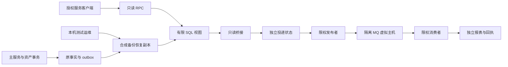

# R5/M6 独立实验威胁模型

> 权威级别：L2（独立实验安全分析）
> 最后更新：2026-10-10
> 范围：`experiments/r5-m6`，个人本机、合成玩家和恢复副本

## 已确认的边界

沿用用户已确认的本机学习环境、R5 独立 RPC/MQ、不拆主资产事务、跨机器延期和内部事件仅测试等条件，不新增公网或真实资产假设。普通玩家和 GM 不持有实验服务凭据，不能假定其拥有 Docker、宿主机或数据库管理员权限。未来网络暴露或真实数据接入时必须重新评估，当前没有未澄清的服务范围问题。

## 资产与入口

资产包括主余额/账本/Run 完整性、结果查询权限、实验报告可信度、数据库/MQ/服务凭据和本机可用性。运行入口是 gRPC 两个查询、认证指标 HTTP、MQ JSON 消费；初始化 CLI/PowerShell、源码生成和 CI 属于运维/构建边界，不是玩家 API。

| 边界 | 具体控制和证据 |
| --- | --- |
| 客户端到 RPC | `RPCServer` 校验 service-id、Bearer hash、scope、deadline 和有界并发；`GetRunResult` 校验 player 范围及 Run 参与关系；仅 loopback |
| RPC/Bridge 到数据 | `002_source_views.sql` 提供有限视图，`cmd/prepare` 只 GRANT SELECT 给 Reader；配置固定恢复库名和账号 |
| Bridge 到主 outbox | `Bridge.Once` 仅 SELECT 视图，无主 pending/status 更新；scan/delivery 写独立数据库；重复扫描弥补晚提交 |
| 发布/消费到 MQ | 独立 r5 vhost，无管理标签；publisher 只写 events，consumer 只读 reports、写 retry/dead，均无 topology configure 权限 |
| 消费到报表 | `DecodeEnvelope` 限制 64 KiB、字段/类型/来源/时效和规范化 hash；`Projection.Apply` 事务和唯一键确保消息/Run 幂等 |
| 运维到环境 | 固定 gm-r5-verify 项目、端口占用检查、受限证据目录、进程路径/启动时间复核、默认仅清理专用卷 |

## 具体威胁与取舍

| 威胁路径 | 可能性 / 影响 / 本机优先级 | 现有缓解与测试 | 剩余边界 |
| --- | --- | --- | --- |
| 本机非授权进程调用结果 RPC，换 player_id 查询别的队伍 | 中 / 中 / 中 | 服务身份、scope、player 白名单、参战关系；鉴权、越权和包体测试 | 客户端 token 泄露后可使用已授权范围；需轮换，不能当玩家 JWT |
| 实验进程使用过宽数据库账号或写主 outbox，抢走原 Worker 任务 | 低 / 高 / 中 | 固定隔离库/账号；仅视图 SELECT；真实 SQL 权限测试证明两种运行账号都不能写原资产/Run/outbox、读原玩家表 | Provisioning 的 root 文件仅供本机受控初始化；拥有管理员权限者仍可改数据 |
| MQ 重投、ACK 前崩溃或 confirm 后未标 published 导致报告重复计奖 | 中 / 中 / 中 | 报表不是发奖依据；message fingerprint 和 run 唯一键、提交后 ACK；实际进程崩溃、并发去重、重复消费测试 | 外部主资产事务不接 MQ；future 接入必须重新设计 |
| 恶意修改同 ID payload，或利用 MySQL JSON 格式变化绕过 hash | 中 / 中 / 中 | 规范化 payload hash + 完整 envelope fingerprint；同 ID 改内容拒绝且进入死信 | SHA256 证明一致性，不是发送者签名；盗取 publisher 凭据仍可伪造新的报表，不能写主资产 |
| broker/报表库失联后无限 retry、ACK 丢事件或死信转移丢失 | 中 / 中 / 中 | DB 回执与 MQ header 双重有限预算、confirmed retry/dead 后 ACK、mandatory return、持久 quorum/至少一次 TTL 死信转移；失联、重启和积压测试 | 单节点不是 HA；磁盘故障/卷删除可丢实验数据，需从恢复副本重建 |
| 洪泛 RPC 或巨大消息耗尽本机内存/阻塞 SQL | 低 / 中 / 低 | 32 KiB RPC、64 KiB MQ、16 个并发、5 秒 deadline、SQL/连接超时、prefetch 和队列长度/资源配额 | 不是公网 DDoS 方案，身份有效者仍能消耗本机资源 |
| 启停脚本误杀复用 PID、删除开发卷，或日志泄露密钥 | 低 / 高 / 中 | 固定专用项目，PID 路径与启动时间检查，默认清理专用卷；结构化状态日志，无 DSN/token/body | Docker 管理员可 inspect 容器环境，宿主机管理员超出本模型 |

## 检测与后续约束

关注 rpc_errors、publisher_failures、retry、dead、duplicates、worker_errors 和 `needs_repair`/死信记录；日志关联 message_id/run_id，不记录凭据或完整消息。Linux race 使用 `_test.go` 中固定目标的临时本机代理，只有隔离测试环境显式开启，生产二进制不包含代理。

全面复核补reports队列至少一次DLX，超过quorum失败投递预算的消息保留死信；重试队列仍有独立业务预算。过期但已applied的精确fingerprint重投仅ACK，不产生新报告；未确认/变更消息继续隔离，真实MQ/race回归验证。该去重例外不允许更换消息内容绕过时效。

当前所有 TCP listener 仅本机，gRPC/AMQP 使用本机明文。接入其他电脑、公网或真实敏感数据前，应引入 TLS/mTLS、来源身份/Run 授权、凭据轮换、审计和容量门槛；不通过放宽 loopback 检查直接复用本机实验。该条件是明确延期，不影响当前本机 R5/M6 退出标准。
