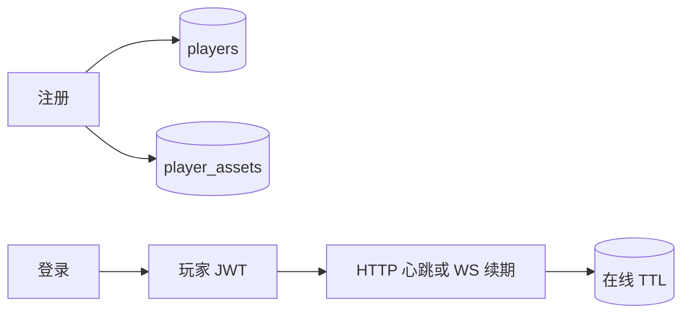

# 需求规格（PRD-lite）

> 文档角色：当前业务需求、边界、优先级与验收追踪
> 权威级别：L1（需求事实源）
> 状态：一期历史与V2/R4需求已实现，外部验收延期
> 适用范围：legacy历史与V2/R4本机Go单体控制面
> 事实来源：当前路由、Handler、Service、Manager、SQL 与 Day27-Day35 验收
> 最后更新：2026-10-10

## V2/R4发布补充

合作PVE首版最多4人、固定关卡、共同目标统一结束、每人最多一个可选个人任务，合法同队贡献按目标规则共享。好友房间与本局队伍分离，拒绝/加载失败按来源处理，退出Run停止新贡献，死亡可增援。默认V2，legacy仅显式回归；R4维护暂停新匹配/新Run并继续既有结算，closed要求先排空。跨机器、真实战斗服和商业容量仍未验收。第1—7节保留一期历史需求，当前验证见 [R4发布](testing/r4-release-acceptance.md)。

## 1. 产品目标

建立一个可在本地重复运行的游戏业务后台服务，使玩家业务、实时会话、可靠结算和 GM 观察形成闭环，并能通过 API、存储数据和自动测试交叉验证。

本项目没有商业立项、市场投放、ROI 或付费模型，因此不虚构 BRD/MRD 内容。

## 2. 角色

| 角色 | 权限边界 |
| --- | --- |
| 玩家 | 访问玩家 HTTP API和玩家 WebSocket，只操作自己的实时业务身份 |
| 管理员 | 访问 `/api/admin/*`，执行玩家管理、审计查询和只读观察 |
| 开发/验证者 | 启动依赖、初始化数据、运行测试、查看日志和存储结果 |

玩家 JWT 与管理员 JWT 使用不同 `subject_type`；两类身份不可互换。

## 3. 当前需求清单

| ID | 优先级 | 用户故事与业务规则 | 验收标准 |
| --- | --- | --- | --- |
| `REQ-OPS-01` | P0 | 作为验证者，我需要判断服务进程是否响应 | `GET /health` 返回 HTTP 200、`code=0` |
| `REQ-AUTH-01` | P0 | 作为玩家，我可以注册账号；用户名唯一，密码只保存 bcrypt hash | 注册同时创建零余额资产行；重复用户名返回 409 |
| `REQ-AUTH-02` | P0 | 作为玩家，我可以登录并获得 24 小时玩家 JWT | 错误凭据返回 401；封禁账号返回 403 |
| `REQ-AUTH-03` | P0 | 作为管理员，我可以登录并获得管理员 JWT | 玩家 token 不能访问管理员接口，管理员 token 不能冒充玩家 |
| `REQ-PLAYER-01` | P0 | 玩家可以查询自己、修改昵称、查询玩家列表和详情 | 空昵称、非法 ID 和不存在玩家返回明确错误 |
| `REQ-PRESENCE-01` | P0 | 玩家可通过心跳维护在线状态并查询结果 | Redis `online:player:<id>` TTL 为 120 秒；失联后自然过期 |
| `REQ-WS-01` | P0 | 玩家可以建立受鉴权的长连接并获得连接信息 | 无效/管理员 token 被拒绝；重复连接由新连接替换旧连接 |
| `REQ-SQUAD-01` | P0 | 玩家可以创建、加入、离开、查询小队并切换 ready | 最多 4 人；状态变化广播；断线清 ready；队长按规则转移 |
| `REQ-MISSION-01` | P0 | 小队可以维护任务会话业务生命周期 | 只允许合法迁移；非队长、未全员在线/ready 等失败可解释 |
| `REQ-MATCH-01` | P0 | 玩家可以创建、查询、取消匹配 ticket | ticket 只允许 `queued -> canceled/timeout`；重复排队被拒绝 |
| `REQ-SETTLE-01` | P0 | finished 任务可以执行服务端可信且可重试的结算 | 客户端不能指定分数/奖励；重复请求不重复发奖；事务整体提交或回滚 |
| `REQ-RANK-01` | P1 | 玩家可以查询任务榜单、个人排名和历史战绩 | 每任务保留个人最佳分；同分先达到者优先；分页上限 50 |
| `REQ-GM-01` | P0 | 管理员可以查询、封禁和解封玩家，并审计危险操作 | 封禁/解封与操作日志同事务；重复状态操作返回 409 |
| `REQ-GM-02` | P1 | 管理员可以查询 Dashboard、操作日志和实时业务摘要 | 支持分页/筛选；观察为只读聚合并带 `X-Request-ID` |
| `REQ-NFR-01` | P0 | 长期事实、实时状态和内存会话必须边界清楚 | MySQL/Redis/内存职责与代码一致，不把投影当事实源 |
| `REQ-NFR-02` | P0 | 关键并发和一致性行为必须可验证 | 单元测试、vet、Linux race、`ws_bot` 与性能基线有记录 |
| `REQ-NFR-03` | P1 | 日志应可追踪且避免泄露 query token | HTTP 返回/记录合法 request ID，access log 只记录 URL path |

## 4. 主要流程

### 4.1 玩家身份与在线



注册中 `players` 与 `player_assets` 在同一个 MySQL 事务创建。登录先校验 bcrypt，再校验封禁状态，最后签发 token。

### 4.2 小队与任务会话

```text
WebSocket 鉴权
-> 创建/加入小队
-> 成员在线且 ready
-> 创建任务会话
-> waiting -> ready -> running -> finished
-> settlement.create
```

`mission_instance` 只表达业务会话和结算生命周期，不执行固定 Tick、物理、技能、AI 或预测纠正。

### 4.3 可靠结算

```text
校验玩家、小队、finished 状态与请求键
-> 开启 MySQL 事务
-> 写 mission_records
-> 按 player_id 排序锁定 player_assets
-> 写 reward_records、余额和 asset_ledger
-> 提交 MySQL
-> best-effort 更新 Redis 排行榜
```

同一任务重复提交返回已有结果；若 Redis 同步失败，MySQL 结算仍然有效，后续幂等重试可再次同步投影。

### 4.4 GM 管理与观察

危险写操作必须校验管理员身份并与审计日志一起提交。实时观察依次读取内存、Redis 和 MySQL，是单实例近实时视图，不是跨存储原子快照或全服监控。

## 5. 异常与边界

- JSON 绑定失败、非法 ID、空昵称/原因、非法时间范围返回 400。
- 缺少或非法 token 返回 401；身份类型错误返回 403。
- 资源不存在返回 404；重复用户名、重复封禁、重复排队等状态冲突返回 409。
- MySQL/Redis 或内部操作失败返回 500 类错误，不在响应中泄露内部错误对象。
- WebSocket 单条消息上限 4096 字节；未知消息返回统一 `server.error`。
- 小队、任务会话和连接是单进程内存状态，重启不恢复。
- 匹配未实现 `matched` 状态和真正撮合成功流程。

## 6. 非功能需求

- 时间字段使用 JSON RFC3339 表达；MySQL 使用 `DATETIME(3)` 和 `+08:00` 开发时区。
- SQL 使用参数占位符；核心资产更新必须在事务内完成。
- Redis 中的排行榜可以从 MySQL settled 记录重建，但当前没有自动重建任务。
- pprof 默认关闭并只允许配置到本机地址。
- 文档必须区分已实现、实验验证、规划中和当前不做。
- 个人项目的 E0-E4 证据不得表述成真实生产经验。

## 7. 当前非目标

- React GM 页面或 Unity Demo 的实际实现。
- 完整战斗服、Dedicated Server、状态同步、帧同步或反作弊。
- 微服务、Zinx、消息队列、Kubernetes、服务网格和自动扩缩容。
- 正式 CI/CD、公网部署、TLS 终止、生产密钥管理和商业 SLO。
- 匹配成功撮合、多实例状态共享与服务重启恢复。

## 8. 追踪矩阵

| 需求 | 当前接口/协议 | 主要模块/数据 | 测试入口 |
| --- | --- | --- | --- |
| `REQ-OPS-01` | `GET /health` | `handler/health.go` | `TC-OPS-001` |
| `REQ-AUTH-01..03` | `/api/register`、`/api/login`、`/api/admin/login` | `auth`、`middleware`、`players`、`admins` | `TC-AUTH-*` |
| `REQ-PLAYER-01` | `/api/me`、`/api/players*` | `handler/player.go`、`players` | `TC-PLAYER-*` |
| `REQ-PRESENCE-01` | `/api/online/*` | Redis online key | `TC-PRESENCE-*` |
| `REQ-WS-01` | `/ws`、`server.*`、`debug.*` | `handler/ws.go`、`ws.Manager` | `TC-WS-*` |
| `REQ-SQUAD-01` | `squad.*` | `squad.Manager` 内存 | `TC-SQUAD-*` |
| `REQ-MISSION-01` | `mission.*` | `mission.Manager` 内存 | `TC-MISSION-*` |
| `REQ-MATCH-01` | `matchmaking.*` | Redis queue/ticket/timeout | `TC-MATCH-*` |
| `REQ-SETTLE-01` | `settlement.create` | settlement、4 张资产/结算表 | `TC-SETTLE-*` |
| `REQ-RANK-01` | `/api/leaderboards/*`、`/api/me/mission-records` | leaderboard、Redis、MySQL | `TC-RANK-*` |
| `REQ-GM-01..02` | `/api/admin/*` | admin、observation、审计表 | `TC-GM-*` |
| `REQ-NFR-01..03` | 全局 | storage boundary、middleware、测试工具 | `TC-NFR-*` |

完整 HTTP 字段以 [OpenAPI](openapi.yaml) 为准，WebSocket 消息以 [WebSocket 协议](ws-protocol.md) 为准，测试用例定义见 [测试计划](test-plan.md)。

## R5/M6 独立实验需求

`REQ-R5-01`：只读 gRPC 查询 settled Run 和有限排行榜，独立服务身份、明确 deadline、查询授权、包体/并发限制、固定版本兼容契约；不增加玩家或 GM 动作入口。

`REQ-R5-02`：只读桥接主 outbox，独立投递/receipt/报表；发布 confirm、manual ACK、有限重试、死信、重复/冲突/过期检查和可靠重建；绝不直接写主奖励、余额、Run 或原 outbox 状态。

`REQ-R5-03`：独立启停/清理、恢复副本和最小权限、真实进程/存储重启、主链路故障隔离与回退。R5 仅完成本机原 M6 实验，跨机器、真实战斗服、DS/调度、多实例和生产部署按各自未来门槛推进。证据见 [R5 验收](testing/r5-m6-acceptance.md)。
