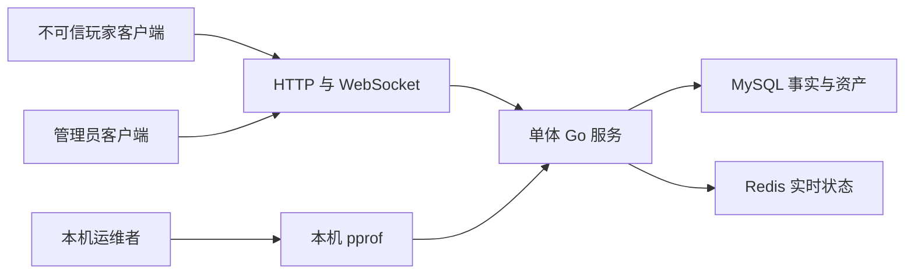

# 安全设计与轻量威胁模型

> 文档角色：当前安全控制、已知风险、威胁模型与改进顺序
> 权威级别：L1（安全事实源）
> 状态：学习环境基线；公网部署前需加固
> 适用范围：当前 Go HTTP/WebSocket、MySQL、Redis 与本地运维
> 事实来源：认证中间件、JWT、Handler、SQL、访问日志、pprof、Compose 与测试
> 最后更新：2026-08-31

## V2/R3安全补充

V2逐请求/周期复核玩家状态和撤销代次；GM重试实时检查operator角色、needs_repair尝试版本、Run状态和资产存在。可信事件和指标监听默认关闭、只绑定loopback、使用独立凭据；WS有全局/IP配额和有界队列。资产唯一键和事务保护奖励，归档保留指纹/序号/奖励依据。共享/公网发布仍需TLS、完整RBAC和外部告警加固。

## 1. 范围与假设

当前服务用于个人本地/测试环境，默认不暴露公网，不保存真实付费资产或真实个人敏感信息。攻击者模型以“能够访问监听端口的远程客户端”为主，不假设其拥有宿主机、Docker daemon、数据库账户或仓库写权限。

如果服务进入共享网络、公网、多人管理员或真实资产环境，本文中多项“中”风险会立即上调；在完成公网前置清单前不能称为生产安全架构。

## 2. 信任边界与资产

| 资产 | 安全目标 |
| --- | --- |
| 玩家/管理员密码 hash、JWT Secret、数据库凭据 | 机密性、完整性 |
| 管理员身份与封禁权限 | 身份真实性、最小权限 |
| 任务结算、余额和资产流水 | 完整性、不可重复发奖、可审计 |
| GM 操作日志 | 完整性、可追踪、隐私最小化 |
| WebSocket 连接、小队、任务、匹配状态 | 完整性、可用性 |
| MySQL/Redis/Go 进程 | 可用性与边界隔离 |

## 3. 当前控制矩阵

| 控制 | 状态 | 当前实现与边界 |
| --- | --- | --- |
| 密码存储 | 已实现 | bcrypt；注册绑定限制字符串长度为 6-72，数据库只存 hash |
| 玩家/管理员身份隔离 | 已实现 | JWT `subject_type`、独立 ID 字段和两套中间件 |
| JWT 算法校验 | 已实现 | 只接受 HMAC 方法，当前使用 HS256；校验有效期 |
| 细粒度 RBAC | 已知缺口 | role 写入 claims，但所有管理员路由只检查 admin subject |
| SQL 注入防护 | 已实现 | 用户值通过 `?` 参数；动态 WHERE 只拼接代码内固定片段 |
| 资产可信计算 | 已实现 | 服务端计算分数/奖励，客户端不决定余额 |
| 结算幂等/防重放 | 已实现 | 三组 UNIQUE、事务、`FOR UPDATE` 和已有结果查询 |
| Request ID | 已实现 | 字符/长度校验后响应与日志关联，不参与鉴权 |
| HTTP 日志脱敏 | 已实现 | 访问日志只记录 path，不记录 raw query 或 body |
| WebSocket 消息限制 | 已实现 | 文本 JSON、4096 字节、读写期限、ping/pong 和写锁 |
| HTTP body/header/timeout 限制 | 已知缺口 | 主 HTTP server 未配置完整 timeout、`MaxHeaderBytes` 或 body 上限 |
| 登录/接口限流 | 已知缺口 | 没有暴力破解、连接洪泛或昂贵查询限流 |
| CORS | 当前未启用 | API 没有 CORS 中间件；未来浏览器前端需明确 allowlist |
| WebSocket Origin | 已知风险 | `CheckOrigin` 当前无条件允许；依赖 bearer query token，不依赖 cookie |
| 可信代理/客户端 IP | 已知风险 | 尚未配置受信代理范围，审计 IP 不能作为独立安全证据 |
| TLS | 环境外 | 本地 HTTP/WS；公网必须由受控入口提供 TLS/WSS |
| pprof 隔离 | 部分实现 | 默认关闭、默认 loopback；配置可被误设为非本机地址 |
| Secret 管理 | 已知风险 | 支持环境变量，但代码/Compose 有本地开发回退值 |
| token 撤销/刷新 | 未实现 | token 固定 24 小时；被盗后有效期内不能主动撤销 |
| 依赖漏洞扫描 | 未实现 | 没有 `govulncheck`/Dependabot/CI 证据 |

## 4. 鉴权与授权

### 玩家 JWT

登录成功后签发包含 `subject_type=player`、`player_id`、`username`、`iat`、`exp` 的 HS256 token。玩家中间件拒绝管理员 subject。

### 管理员 JWT

管理员 token 包含 `subject_type=admin`、`admin_id`、`username`、`role`。管理员中间件拒绝玩家 subject。当前 `role` 不用于接口级授权，所以不能将项目描述为完整 RBAC。

### WebSocket

升级前从 query 读取 player token；管理员 token 被拒绝。同玩家新连接替换旧连接，但这不是 token 撤销机制。当前 `CheckOrigin=true`，未来浏览器场景必须同时重新设计 Origin allowlist 和 token 传递。

## 5. 输入、输出与敏感数据

- Gin binding 和显式 Trim/Parse 校验用户名、密码长度、昵称、ID、原因和筛选时间。
- match/leaderboard/request ID/nonce/idempotency key 使用字符与长度约束。
- SQL 参数化；没有文件上传、模板执行、外部 URL 抓取或 OS 命令入口。
- API 不序列化 `password_hash`；GM 观察不返回 token、nonce、idempotency key、连接对象或内部锁。
- 当前 `settlement.create.result`/`settlement.created` 会序列化结算 record 中已经使用的 nonce 与 idempotency key。唯一约束阻止重复发奖，但未来应评估是否需要对其他参与者隐藏这些请求键。
- 审计记录包含 IP、User-Agent、用户名和操作 detail；导出、截图和备份前必须脱敏。
- 服务端错误响应只返回固定 message，不返回 SQL/Redis 内部错误对象。

## 6. 威胁模型

| ID | 滥用路径 | 现有控制 | 缺口 | 可能性/影响 | 优先级与建议 |
| --- | --- | --- | --- | --- | --- |
| `TM-001` | 将开发默认 JWT/数据库/seed 凭据直接用于共享环境，攻击者伪造身份或访问数据 | 环境变量可覆盖；仓库标注学习环境 | 启动不强制生产 Secret，缺少密钥管理 | 本地低；公网高 / 高 | 高：公网前增加环境模式、强制 Secret、独立玩家/管理员密钥与轮换流程 |
| `TM-002` | 自动尝试玩家/管理员密码或大量注册，消耗 bcrypt CPU并接管弱口令账号 | bcrypt、登录错误不区分用户名是否存在 | 无速率限制、锁定、MFA 或告警 | 共享网络中 / 高 | 高：按 IP+账号限流、退避、指标告警；管理员增加更强认证 |
| `TM-003` | 攻击者获得 URL 中 token 后，在 24 小时内重放 WebSocket；恶意站点可跨 Origin 发起连接 | player subject 校验、访问日志不记 query、重复连接替换 | query token、`CheckOrigin=true`、无撤销 | 本地低；浏览器公网中 / 高 | 高：改握手鉴权、Origin allowlist、短期 WS ticket、撤销/轮换 |
| `TM-004` | 慢请求、大 body/header、连接洪泛或昂贵分页/扫描耗尽 goroutine、CPU、内存 | WS 4096 字节与超时；分页有上限；Recovery | HTTP server timeout/header/body limit 与全局限流缺失 | 可访问端口时中 / 中高 | 高：补 HTTP timeouts、body/header limits、连接/路由限流和资源指标 |
| `TM-005` | 任一管理员 token 执行封禁/解封或查看审计/观察信息 | admin subject、危险操作事务审计 | role 未执行授权，token 被盗无法撤销 | 当前单管理员低 / 高 | 中：定义权限矩阵并在中间件/Handler 强制；审计失败告警 |
| `TM-006` | pprof 被误绑定公网，泄露调用栈、内存和运行信息或被滥用消耗资源 | 默认关闭且默认 `127.0.0.1`、独立 mux | 配置没有强制 loopback、没有认证 | 本地低 / 高 | 中：生产禁用或网络隔离并校验监听地址 |
| `TM-007` | 已登录玩家枚举自增 ID并读取全体玩家状态/封禁原因 | 需要玩家 JWT；不返回密码 hash | 玩家列表/详情暴露字段较宽、ID 可枚举 | 中 / 中 | 中：按真实产品需求缩减字段和可见范围，避免公开封禁 detail |
| `TM-008` | 窃取的 24 小时 JWT持续访问；改密或封禁不会立即使已签发 token 失效 | exp、subject 隔离；封禁只在登录时检查 | 无 jti、撤销表、token version 或短 access token | 中 / 中高 | 中：短期 access token + revocation/version；受保护请求按风险复核账号状态 |
| `TM-009` | Redis 排行同步失败导致榜单滞后，或客户端利用重复请求反复触发修复路径 | MySQL 先提交、UNIQUE 幂等、Redis Lua | 无 Outbox/自动重建/异常指标 | 低 / 低（资产不受影响） | 低：增加重建命令、失败指标与对账；保持 MySQL 为事实源 |
| `TM-010` | 伪造转发头或控制 pong payload 污染审计/运行日志，降低追踪可信度 | request ID 字符限制；访问日志不记 query/body | 未配置可信代理；pong appData 直接写日志 | 本地低 / 中 | 低：配置可信代理、限制/转义日志字段且不记录 pong payload |

风险评级最受两个假设影响：是否公网暴露，以及是否使用真实管理员/资产。任一答案变为“是”，`TM-001` 至 `TM-005` 都应在发布前处理。

## 7. 手工安全复核重点

| 路径 | 原因 | 关联威胁 |
| --- | --- | --- |
| `backend/internal/auth/jwt.go` | token claims、算法、有效期与未来撤销 | TM-001/003/008 |
| `backend/internal/middleware/auth.go` | 玩家/管理员权限边界 | TM-005/008 |
| `backend/internal/handler/auth.go` | 注册、bcrypt、登录与封禁逻辑 | TM-002/008 |
| `backend/internal/handler/ws.go` | query token、Origin、资源限制和结算入口 | TM-003/004 |
| `backend/internal/settlement/service.go` | 资产完整性、幂等与锁顺序 | TM-009 |
| `backend/internal/middleware/access_log.go` | token 和个人数据脱敏 | TM-003 |
| `backend/cmd/server/main.go` | HTTP timeouts、诊断服务与关闭行为 | TM-004/006 |
| `backend/internal/config/config.go` | 开发默认 Secret 与环境覆盖 | TM-001 |
| `deploy/docker-compose.yml` | 本地端口与开发凭据暴露 | TM-001 |

## 8. 公网前置清单

以下均为后续要求，不是当前已实现能力：

- 强制外部 Secret，移除/拒绝共享环境开发默认值，轮换管理员 seed。
- TLS/WSS、可信代理配置、明确 CORS 与 WebSocket Origin allowlist。
- 主 HTTP server 的 read header/read/write/idle timeout、header/body 上限。
- 登录、注册、WebSocket 连接和昂贵查询限流；异常指标与告警。
- 管理员细粒度授权、token 撤销/短期 access token和更强管理员认证。
- `govulncheck`、Secret 扫描、依赖更新和可审查构建流程。
- 数据最小化、备份加密、审计保留规则和恢复演练。

CSRF 当前不是 Bearer Authorization API 的主要风险；若未来改用 cookie 身份，必须重新设计 SameSite、Secure、HttpOnly 和 CSRF 防护。
