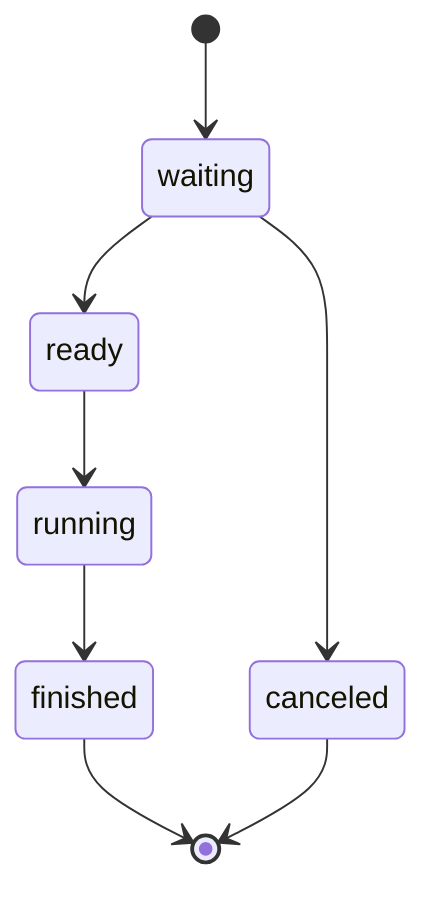
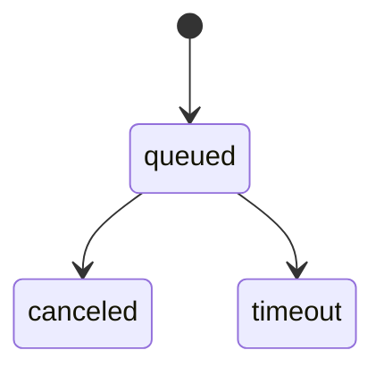

# 系统详细设计（LLD）

> 文档角色：当前模块调用、状态机、并发、事务、缓存与失败处理
> 权威级别：L1（LLD 事实源）
> 状态：已实现
> 适用范围：legacy 与 V2 Go 单体服务内部设计
> 事实来源：`backend/cmd/server` 与 `backend/internal` 当前代码
> 最后更新：2026-10-11

## 1. 启动顺序

第1—11节中的历史链路以 legacy 为背景；V2 实际调用和可靠事务见第12节。当前共用服务器已配置超时、body/header预算、依赖就绪探针和信号关闭，不再使用无期限 HTTP 默认值。

`cmd/server/main.go` 按以下顺序启动：

1. 从环境变量加载应用、MySQL、Redis、JWT 和 pprof 配置。
2. 建立 MySQL 连接并 `PingContext`。
3. 建立 Redis 客户端并 `Ping`。
4. 配置开启时，启动独立 pprof HTTP server。
5. 创建 Router、Handler、Service 和内存 Manager。
6. 启动匹配超时后台循环。
7. 在 `APP_PORT` 上启动 HTTP/WebSocket server。

MySQL 或 Redis 首次连接失败时进程直接退出；运行中依赖失联会使就绪探针返回503，生命周期停止时服务关闭监听、WS和Worker。当前没有自动启动重试或多实例故障转移。

## 2. 模块职责与依赖

| 包 | 职责 | 直接依赖 |
| --- | --- | --- |
| `config` | 环境变量与默认开发配置 | OS env |
| `database` | MySQL DSN、连接池与 ping | `database/sql` |
| `cache` | Redis 连接与 ping | go-redis |
| `auth` | 玩家/管理员 JWT 生成与解析 | jwt/v5 |
| `middleware` | request ID、访问日志、玩家/管理员鉴权 | Gin、`auth` |
| `handler` | HTTP 绑定/校验/响应，WebSocket 消息分发 | 各 Service/Manager |
| `ws` | 连接注册、替换、发送与协议 DTO | Gorilla WebSocket |
| `squad` | 小队成员、ready、在线、队长和统计 | 进程内 map + mutex |
| `mission` | 任务会话生命周期和统计 | 进程内 map + mutex |
| `matchmaking` | ticket、队列、玩家索引和超时清理 | Redis + mutex |
| `settlement` | 服务端结算、幂等、防重放和资产事务 | MySQL、`mission` |
| `leaderboard` | Redis 最佳分投影和 MySQL 战绩 | MySQL、Redis |
| `observation` | GM 只读聚合 | MySQL、Redis、各 Manager |
| `diagnostics` | 独立本机 pprof server | `net/http/pprof` |

Router 是依赖装配点。业务包不反向依赖 Router，也没有跨服务 RPC。

## 3. HTTP 请求管线

```text
RequestID
-> AccessLog
-> Recovery
-> PlayerAuth 或 AdminAuth（受保护路由）
-> Handler 参数绑定与业务调用
-> JSON 响应 + X-Request-ID
```

- 合法客户端 `X-Request-ID` 会保留；非法字符、空值或超过 64 字符时生成新 ID。
- AccessLog 只记录 URL path，不记录 raw query，因此不会写入 WebSocket query token。
- 玩家鉴权只接受 `subject_type=player` 且 `player_id>0`。
- 管理员鉴权只接受 `subject_type=admin` 且 `admin_id>0`。
- Gin Recovery 捕获 panic，但当前没有结构化错误对象或统一 HTTP 响应构造器。

## 4. WebSocket 连接生命周期

1. `/ws` 从 query 读取 player token并解析玩家 claims。
2. 升级连接，生成随机 `connection_id`。
3. `ws.Manager.Register` 保存连接；同玩家新连接替换旧连接。
4. 设置 4096 字节读限制、读/写期限和 pong handler。
5. 写 Redis 在线 key，并启动在线 TTL 续期和 WebSocket ping goroutine。
6. 发送 `server.welcome`，进入消息读取循环。
7. 每条消息解析统一 envelope，按 `type` 分发并使用连接级写锁回复。
8. 断开时仅注销当前 connection，停止续期，更新小队离线状态并广播。

`ws.Manager` 使用读写锁保护玩家连接 map；注销会比对 connection ID，防止旧连接关闭时误删新连接。

## 5. 业务状态机

### 5.1 小队

- 一名玩家最多属于一个小队。
- 小队最多 4 人；创建者默认 ready 且为队长。
- 新成员默认未 ready。
- 断线保留成员，但设置 `online=false`、`ready=false`。
- 队长断线时转给最早遍历到的其他在线成员；重连不会自动夺回。
- 最后一名成员离开时小队解散。

`squad.Manager` 的所有写操作使用同一互斥锁，读和统计使用读锁；返回值是副本，调用方不能直接修改内部状态。

### 5.2 任务会话



同一小队只能有一个非终态任务会话。`mission.Manager` 使用独立读写锁和三组索引：instance ID、squad ID、player ID。它保存业务生命周期元数据，不执行战斗模拟。

### 5.3 匹配 ticket



ticket 写入 Redis Hash，同时维护玩家索引、按 `mission_id` 分区的 ZSet 队列和全局超时 ZSet。后台每秒清理到期 ticket。Manager 的进程内 mutex 串行化本实例内复合 Redis 操作；这不是跨实例分布式锁。

## 6. 锁与并发规则

- 每个内存 Manager 只保护自己的 map，不向外暴露锁。
- Handler 不在持有一个 Manager 锁时调用另一个 Manager，因此没有跨 Manager 嵌套锁顺序。
- WebSocket 每个连接使用独立写锁，避免多个 goroutine 并发写同一连接。
- matchmaking mutex 保护当前实例的“检查 + 多 key 更新”；Redis `TxPipelined` 只减少往返，不等同数据库事务或跨实例互斥。
- 资产事务按 `player_id` 升序执行 `SELECT ... FOR UPDATE`，统一多人奖励锁顺序。
- Day34 Linux race 已覆盖自动测试实际执行路径；未覆盖路径仍需通过新增测试验证。

## 7. 结算与幂等

`settlement.create` 的处理顺序：

1. 校验 `mission_instance_id`、`idempotency_key`、nonce 格式。
2. 从内存任务 Manager 读取任务，校验小队、参与者、finished 状态和时间。
3. 由服务端根据开始/结束时间计算耗时、分数和固定奖励。
4. 开启 MySQL 事务并尝试写 `mission_records`。
5. 唯一键冲突时解析已有结果：同一业务请求返回已有结果，不重复写资产。
6. 为每名参与者创建 reward，锁定并更新余额，写 append-only ledger。
7. 提交事务后返回完整 settlement。
8. 首次创建后 best-effort 更新 Redis 排行榜并广播 `settlement.created`。

MySQL UNIQUE 约束是并发幂等最终防线。Redis 排行失败只记录错误，不能使已经提交的资产事务回滚。

## 8. 排行榜投影

- 每个任务模板使用 `leaderboard:{mission_id}:scores` ZSet 和 `leaderboard:{mission_id}:players` Hash。
- Lua 脚本原子比较旧最佳分并更新两类 key。
- 分数倒序；同分通过反向达到时间编码，使较早达到者先排列。
- 玩家昵称和用户名查询来自 MySQL，排行本身不是身份事实源。
- 当前没有定时重建、赛季归档、TTL 或跨 Redis 故障恢复任务。

## 9. GM 观察

实时摘要依次读取：WebSocket 连接数、小队统计、Redis queued 数、任务统计和 MySQL settled 数。玩家观察聚合玩家/余额、连接、小队、任务、ticket 与最近结算。

这些读取没有跨存储锁；`observed_at` 表示本次聚合完成时间，不表示同一时刻的一致快照。观察请求只写标准日志，不写高频数据库审计；封禁/解封仍写事务审计。

## 10. 失败、重试与降级

| 场景 | 当前行为 |
| --- | --- |
| MySQL/Redis 启动连接失败 | 进程退出 |
| HTTP 参数/身份错误 | 返回稳定 HTTP 状态和业务错误码 |
| WebSocket 未知/非法消息 | 返回 `server.error`；致命连接错误后关闭 |
| ticket 到期 | 后台循环转为 timeout 并尽力通知在线玩家 |
| 结算重复提交 | 由唯一约束和已有结果查询幂等返回 |
| Redis 排行同步失败 | MySQL 保持成功；日志记录，后续结算重试可修复 |
| GM 观察某数据源失败 | 当前请求整体返回 500，不返回部分结果 |
| 进程重启 | 内存连接、小队、任务会话丢失 |

legacy 没有玩法 Outbox/可靠补偿；共享鉴权入口已有基础限流。V2 的持久化恢复和事务边界见第12节；未引入通用工作流、熔断器或 MQ 死信队列。

## 11. 契约入口

- HTTP 路径与 schema：[OpenAPI](openapi.yaml)
- HTTP 调试示例：[API 使用指南](api-overview.md)
- WebSocket 消息：[WebSocket 协议](ws-protocol.md)
- 表、索引与 Redis key：[数据库设计](database-design.md)
- 安全控制与已知风险：[安全设计](security-design.md)

## 12. V2 调用与事务

V2 入口为 `handler/v2_transport.go`，按 `v2.*` 分发到 `pve.App.Command`。命令在 MySQL 锁定玩家并检查 `operation_id` 指纹，领域服务按状态与对象版本修改事实，再保存回执/outbox；响应丢失后不重复创建对象。业务事务不等待 WS 网络写入，连接使用有界发送队列。

匹配按完整来源票据组合，不拆好友房间；MySQL lane 行锁串行裁决候选、确认与加载回退。Run 行锁串行处理受信来源事件；乱序事件可靠保存，连续收到水位与已应用水位分别记录，缺口超期以已应用边界技术中止。目标依赖只允许事件处理开始时已激活步骤，可信对象去重防止重复进度。

Run 结束后 Worker 以相同 Run 重试结算。R1 每个参与者使用独立事务确认结果、任务完成/解锁、奖励、余额、共享 `asset_ledger` 与个人活动占用释放；一人失败仍处理其余人。全部参与者 settled 后才 `FinalizeRun` 关闭 Run、开放原好友房间并清准备；重试跳过已完成结果。五次失败进入 `needs_repair`，由当前数据库角色为 `operator` 的管理员在故障消除后调用受控重试 API；重试回执和审计同事务，不直接改币。通知与 Redis 投影不作为奖励或释放占用的依据。

`GET /api/v2/me/activity` 在同一只读 Repeatable Read 事务中读取本人活动、Party、Ticket、Proposal、Run和pending引用；队友个人任务裁剪。无活动锁仍可查房间，历史结果放 `latest_result`；结果接口追加本人奖励和结算状态。发布规则禁用阻止新排队/分配，已创建 Run 使用自己的快照。候选自动重组封顶、HTTP/WS限流和资源拒绝分支已有本地测试；容量上限仍待独立验证。详细执行与保留边界见 [维护与回退实施](design/v2-r4-implementation.md)。

R2 产品层在同一控制面增加规则目录/任务兼容预览/有限推荐；预览只返回公开机会和本人的任务进度。招募成员保存在独立偏好表，整组入队时按 `source_kind` 生成独立票据，不加入好友Party成员；候选确认仍逐人完成。续组申请先写提案和响应，全部接受后锁定源关系/版本/活动占用并原子创建或保留Party，拒绝和过期不迁移。任务停用要求玩家空闲，保留永久进度；周期任务用UTC period和完成唯一键，满足即时条件先进入pending，Worker确认后发奖，区间条件留到Run终态。damage/heal/rescue事件只接受有效效果和唯一action证据。

## 13. R5 独立查询与投递

2026-10-10复核补充主任务记录：Run终止或参与者永久left时，provisional/active尝试转closed，completed保持；死亡/暂时断线仍不关闭个人任务。不兼容任务也关闭本局尝试，不推进长期进度或发个人奖。

`pve.reporting.v1.Reporting` 仅提供 `GetLeaderboard`、`GetRunResult`；固定 Proto 编号、类型、嵌套消息与方法签名，客户端必须提供独立身份和 deadline。结果按 player 范围及参战关系授权，榜单最多100条，包体/并发有界，不复用玩家 JWT。

Bridge 读取原 outbox 的已 settled Run 视图，不更新原状态。独立 MySQL 扫描水位与消息事务提交，定期回查补晚提交；首次投递时间固定。Publisher 持有独立 delivery 行锁，取得 confirm 并确认未 mandatory return 后才标 published；失败有限重试进入 needs_repair。Consumer 规范化消息、检查来源/时效/hash，在事务里锁 message receipt、核对完整 envelope fingerprint，按 source/run 唯一键落报表，再 ACK。重试/死信必须经 confirmed 发布；DB 失联仍依赖 MQ header 限制预算。详细代码和可重复故障测试在 [独立模块](../experiments/r5-m6/README.md)。
