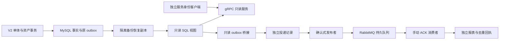

# R5/M6：独立只读 RPC 与可靠消息实验

本目录是独立 Go 模块，不是主后端的微服务改造。主 `backend` 不导入它、不依赖 RabbitMQ/gRPC；Run、任务、奖励、余额和原 Worker 仍由主模块处理。

## 结构与实际链路



| 目录 | 职责 |
| --- | --- |
| `proto` | 唯一 RPC 契约、兼容基线与描述符 |
| `gen` | 固定工具生成的 Go/C# 消息与 Go RPC 接口；C# 编译夹具 |
| `fixtures` | 无凭据的四人结果示例；实际验收使用主服务产生的结算 |
| `schema/001_reporting.sql` | 独立投递、扫描进度、去重回执和报表表 |
| `schema/002_source_views.sql` | 恢复副本中的有限只读视图 |
| `internal/experiment` | 鉴权、RPC、查询、桥接、发布、消费、指标和测试 |
| `cmd/r5` | `rpc/bridge/publisher/consumer` 四种独立进程角色 |
| `cmd/prepare` | 仅对隔离副本和独立 MQ 虚拟主机进行初始化 |
| `cmd/query` | 使用独立服务凭据、两秒截止时间查询 RPC |
| `deploy` | 本机启动、停止、代码生成和完整验收脚本 |

## 环境与入口

需要 Go 1.25.6 或兼容的更新版本、Docker Compose、.NET 10、PowerShell 7。生成契约另需 Protoc 36.2、protoc-gen-go 1.36.12 和 protoc-gen-go-grpc 1.6.2，可直接放在 PATH，或向生成脚本传 `-ToolsRoot`。固定 gRPC Go 1.84.0、Protobuf 1.36.12、AMQP Go 客户端 1.15.0、RabbitMQ 4.3.6；镜像内包含 Erlang，无需安装原生 Windows 服务。

普通检查不启动依赖：

```powershell
cd experiments/r5-m6
go test ./...
go vet ./...
```

此时带 `Integration` 的真实服务测试会 SKIP；不能以这个命令宣称完整验收。完整本机验收：

```powershell
./deploy/verify.ps1
```

脚本先检查专用项目是否存在、端口是否占用，然后构建主服务与独立实验；自动准备独立 MySQL/Redis/RabbitMQ，迁移空测试库、跑真实四人控制面和结算、备份恢复、初始化最小权限账号，运行真实服务测试及 Linux race，再执行实际进程故障、存储重启、主链路隔离和回退。默认结束后清理实验进程、容器、网络、卷与临时凭据，不删除原开发卷。

数据、二进制和私有证据默认放系统临时目录的 `pve-r5-acceptance`，可通过 `-EvidenceRoot` 选择其他磁盘。容器镜像和命名卷仍由现有 Docker 存储管理，不搬迁其他项目数据。证据目录 ACL 仅当前用户和 SYSTEM，不进入 Git；无真实个人数据，只有本机合成账号。默认清理后保留合成备份和去敏日志，不保留可用的临时凭据。

Linux/GitHub Actions 的真实集成入口是 `bash deploy/verify-ci.sh`。它在临时目录和独立容器中生成合成结算、备份恢复和最小权限账号，运行真实 MySQL/RabbitMQ race，并在 broker 停止后验证主结算与资产对账。脚本不可连接开发或生产数据库。

## 保留环境进行手动学习

```powershell
./deploy/verify.ps1 -KeepEnvironment
```

记下最后输出的证据目录，用实际路径替换以下占位值：

```powershell
$r5Directory = '<验收输出的完整目录>'
./deploy/start.ps1 -EnvironmentDirectory $r5Directory
& "$r5Directory\bin\query.exe" -config "$r5Directory\runtime.json" -clients "$r5Directory\clients.json"
```

查询应返回奖励总额排行榜。同分按玩家 ID 升序，`rank` 是展示位次。主服务不运行时，这个查询仍读取恢复副本。Run 查询需要 `-run <run_id> -player <已授权参战者ID>`；授权参战者能够查看本 Run 的有限队伍结果，不返回私聊、账号或任务内部状态。

RPC 地址 `127.0.0.1:18090`，指标地址 18091—18094；实验 RabbitMQ AMQP/管理地址 25672/25673，均只监听本机。MySQL/Redis 专用端口为 23306/26379。管理和指标需要独立凭据，不能用玩家 JWT；账号密码不要粘贴到聊天或日志。

```powershell
./deploy/stop.ps1 -EnvironmentDirectory $r5Directory
```

默认停止进程、容器和网络，保留数据和凭据。重新执行 `start.ps1` 即可恢复。停止脚本校验记录的进程路径和启动时间，避免 PID 被重用时误杀其他程序。

```powershell
./deploy/stop.ps1 -EnvironmentDirectory $r5Directory -ResetData
```

`-ResetData` 丢弃本实验 MySQL/RabbitMQ 卷和临时凭据；之后需要重新运行验收脚本初始化。Docker Desktop 不自动关闭，以免影响其他项目；确认没有别的容器工作后，可以手动退出。

## 契约、安全与可靠性约定

- `.proto` 包为 `pve.reporting.v1`；只提供 `GetLeaderboard`、`GetRunResult`，不提供玩家动作或资产写 RPC。现有 HTTP/WS/OpenAPI 不增加这些内部服务。
- 调用须携带 `service-id` 和独立 Bearer token。服务配置只保存 token SHA256，分 `leaderboard/result/metrics` 范围；结果查询另校验具体 player 范围与实际参战关系。请求必须有不超过五秒的 deadline，客户端默认两秒，榜单最多 100 条，收包上限 32 KiB，查询同时最多 16 个。
- Protobuf 加字段须用新编号；不可修改现有字段编号、类型、列表属性、包名或服务方法。`proto/compatibility.json` 固定基线；已验证未知字段保留。生成脚本为 `deploy/generate.ps1`。
- Reader 只能 SELECT 恢复副本的四个 SQL 视图，没有原始玩家表、资产/Run/outbox 写权限。Projector 仅可写 `game_realtime_r5_reports`。配置拒绝开发库名、root 和公网地址。
- 原 outbox 的 `pending/published` 状态不属于实验。Bridge 读 `v2.run.result` 并验证已经统一关闭和 settled，保存自己的扫描水位和消息，定期从头回查捕获晚提交；不会推进主 Worker 水位。扫描去重不更新首次生成的消息时间。
- Envelope 固定 `message_id/schema_version/source/published_at/type/payload_hash/payload`。`published_at` 是首次形成投递记录的时间；消费时最长一天，未来时间和过期消息进入死信，不虚构奖励。payload 规范化后计算 SHA256，避免 MySQL JSON 格式变化造成误拒绝。
- 发布必须取得 confirm，并检查 mandatory return；只有成功路由才标 `published`。失败有限重试，超过预算进 `needs_repair`；这个状态只暂停实验投递。
- Consumer 先在事务中保存去重回执和报表，提交后才 ACK。同 ID 改 payload/时间/来源被拒绝；同 Run 多个合法消息只生成一个报表。有限重试同时记录 MySQL 回执和 MQ header；报表库不可用时 MQ 重试预算仍有效。重试和死信转投确认前不 ACK 原消息。
- 使用持久 quorum 队列和 persistent 消息；重试队列使用 TTL、至少一次死信转移，消费者 prefetch=10。单节点 broker 的重启恢复实验不等于 RabbitMQ 集群高可用。
- reports队列同样配置至少一次dead-letter，进程反复失败超过quorum默认20次预算时消息保留在dead队列；4.3的explicit NACK不增加失败计数，业务重试仍由x-r5-attempt有限预算控制。修改已有队列参数前先reset本实验并重新初始化。已applied且完整fingerprint一致的过期消息仅ACK去重，未确认或内容变化的消息仍隔离。
- 日志只记角色、方法、状态、消息 ID、Run ID、hash 和耗时；不输出 token、密码、DSN 或完整消息正文。指标需要 metrics 范围凭据。

## 排障、重建与回退

先看证据目录的 `*.stdout.log/ *.stderr.log`、`integration.log`、`race.log`、`summary.json`，再查看本实验 `r5_deliveries/r5_receipts` 和 RabbitMQ `r5.dead.queue`。出现 `needs_repair` 或死信，先修复连接/数据原因，禁止靠重投给主资产发奖。

过期、身份不符、同 ID 不同内容的死信应保留检查，不能自动改 ID 重新“成功”。单纯发布失败的 `needs_repair`，在停止 publisher 并恢复 broker 后，可由实验库账号将该记录恢复 `pending`、`attempts=0`、`next_attempt_at=UTC_TIMESTAMP(3)`；这只影响报表传输。需要从零重建时先停止 bridge/publisher/consumer，清空独立四张表并重放来源；不清主事实/主 outbox、不清开发 Redis。真实测试已验证投递与报表重建。

源 outbox 已归档且 payload 不再有 run_id 的旧记录，必须依靠保留的 fixture/备份恢复；不承诺无限历史回放。首次读取很久以前的恢复副本会生成新的投递时间，但原 settled_at 保持原事实。

回退仅停止四个实验角色及专用依赖；主项目无需改配置或回滚资产。跨机器、Unity DS/UE DS、生产来源、调度、多实例、消息总线接入主链路不属于本次 R5/M6 退出标准。
